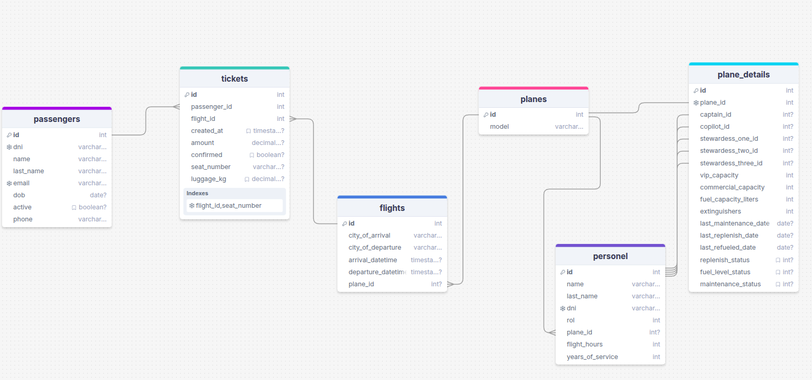

# Base de datos para una Aerolínea

## Tipos ENUM Definidos

| Nombre ENUM          | Valores Permitidos                                  | Descripción                                          |
| :------------------- | :-------------------------------------------------- | :--------------------------------------------------- |
| `replenished_status` | '`pending`', '`replenished`', '`empty`', '`used`'   | Estado de reabastecimiento de suministros del avión. |
| `fuel_status`        | '`refueled`', '`pending`'                           | Estado del combustible.                              |
| `maintenance_status` | '`pending`', '`performed`'                          | Estado del mantenimiento.                            |
| `personel_rol`       | '`stewardess`', '`copilot`', '`pilot`', '`steward`' | Roles del personal de la aerolínea.                  |

---

## Tablas de la Base de Datos Aerolínea

### `planes`

| Columna      | Tipo de Dato | Restricciones                                 | Descripción                              |
| :----------- | :----------- | :-------------------------------------------- | :--------------------------------------- |
| `id`         | `SERIAL`     | `PRIMARY KEY`                                 | Identificador único del avión            |
| `model`      | `VARCHAR`    | `NOT NULL`                                    | Modelo del avión (ej. "Boeing 737")      |
| **FKs:**     |              |                                               |                                          |
|              |              | `plane_details.plane_id` -> `planes.id` (1-1) | Vínculo a detalles específicos del avión |
| **Ref por:** |              |                                               |                                          |
|              |              | `personel.plane_id` -> `planes.id`            | Personal asignado a este avión           |
|              |              | `flights.plane_id` -> `planes.id`             | Vuelos operados por este avión           |

### `passengers`

| Columna      | Tipo de Dato | Restricciones                             | Descripción                             |
| :----------- | :----------- | :---------------------------------------- | :-------------------------------------- |
| `id`         | `SERIAL`     | `PRIMARY KEY`                             | Identificador único del pasajero        |
| `dni`        | `VARCHAR`    | `UNIQUE`, `NOT NULL`                      | Documento de identidad del pasajero     |
| `name`       | `VARCHAR`    | `NOT NULL`                                | Nombre del pasajero                     |
| `last_name`  | `VARCHAR`    | `NOT NULL`                                | Apellido del pasajero                   |
| `email`      | `VARCHAR`    | `UNIQUE`, `NOT NULL`                      | Email del pasajero                      |
| `dob`        | `DATE`       | `NOT NULL`                                | Fecha de nacimiento                     |
| `active`     | `BOOLEAN`    | `DEFAULT true`                            | Si el registro del pasajero está activo |
| `phone`      | `VARCHAR`    |                                           | Número de teléfono                      |
| **Ref por:** |              |                                           |                                         |
|              |              | `tickets.passenger_id` -> `passengers.id` | Boletos comprados por este pasajero     |

### `personel`

| Columna            | Tipo de Dato   | Restricciones                                      | Descripción                                  |
| :----------------- | :------------- | :------------------------------------------------- | :------------------------------------------- |
| `id`               | `SERIAL`       | `PRIMARY KEY`                                      | Identificador único del miembro del personal |
| `name`             | `VARCHAR`      | `NOT NULL`                                         | Nombre del miembro del personal              |
| `last_name`        | `VARCHAR`      | `NOT NULL`                                         | Apellido del miembro del personal            |
| `dni`              | `VARCHAR`      | `UNIQUE`, `NOT NULL`                               | Documento de identidad                       |
| `rol`              | `personel_rol` | `NOT NULL` (ENUM)                                  | Rol del personal (piloto, azafata, etc.)     |
| `plane_id`         | `INTEGER`      | `FK REFERENCES planes(id) ON DELETE SET NULL`      | Avión asignado principalmente (opcional)     |
| `flight_hours`     | `INTEGER`      | `DEFAULT 0`                                        | Horas de vuelo acumuladas                    |
| `years_of_service` | `INTEGER`      | `DEFAULT 0`                                        | Años de servicio                             |
| **Ref por:**       |                |                                                    |                                              |
|                    |                | `plane_details.captain_id` -> `personel.id`        | Como capitán en detalles de avión            |
|                    |                | `plane_details.copilot_id` -> `personel.id`        | Como copiloto en detalles de avión           |
|                    |                | `plane_details.stewardess_..._id` -> `personel.id` | Como azafata(s) en detalles de avión         |

### `flights`

| Columna              | Tipo de Dato                  | Restricciones                          | Descripción                      |
| :------------------- | :---------------------------- | :------------------------------------- | :------------------------------- |
| `id`                 | `SERIAL`                      | `PRIMARY KEY`                          | Identificador único del vuelo    |
| `city_of_arrival`    | `VARCHAR`                     | `NOT NULL`                             | Ciudad de llegada                |
| `city_of_departure`  | `VARCHAR`                     | `NOT NULL`                             | Ciudad de partida                |
| `arrival_datetime`   | `TIMESTAMP WITHOUT TIME ZONE` | `NOT NULL`                             | Fecha y hora de llegada          |
| `departure_datetime` | `TIMESTAMP WITHOUT TIME ZONE` | `NOT NULL`                             | Fecha y hora de salida           |
| `plane_id`           | `INTEGER`                     | `NOT NULL`, `FK REFERENCES planes(id)` | Avión que opera el vuelo         |
| **Ref por:**         |                               |                                        |                                  |
|                      |                               | `tickets.flight_id` -> `flights.id`    | Boletos vendidos para este vuelo |

### `tickets`

| Columna        | Tipo de Dato | Restricciones                                               | Descripción                         |
| :------------- | :----------- | :---------------------------------------------------------- | :---------------------------------- |
| `id`           | `SERIAL`     | `PRIMARY KEY`                                               | Identificador único del boleto      |
| `passenger_id` | `INTEGER`    | `NOT NULL`, `FK REFERENCES passengers(id)`                  | Pasajero al que pertenece el boleto |
| `flight_id`    | `INTEGER`    | `NOT NULL`, `FK REFERENCES flights(id)`                     | Vuelo para el que es el boleto      |
| `created_at`   | `TIMESTAMP`  | `DEFAULT CURRENT_TIMESTAMP`                                 | Fecha y hora de emisión del boleto  |
| `amount`       | `DECIMAL`    | `NOT NULL`                                                  | Precio del boleto                   |
| `confirmed`    | `BOOLEAN`    | `DEFAULT false`                                             | Si el boleto está confirmado        |
| `seat_number`  | `VARCHAR`    | `NOT NULL`                                                  | Número de asiento                   |
| `luggage_kg`   | `DECIMAL`    |                                                             | Peso del equipaje en kg             |
|                |              | `CONSTRAINT uq_flight_seat UNIQUE (flight_id, seat_number)` | Asiento único por vuelo             |

### `plane_details`

| Columna                 | Tipo de Dato         | Restricciones                                                      | Descripción                                     |
| :---------------------- | :------------------- | :----------------------------------------------------------------- | :---------------------------------------------- |
| `id`                    | `SERIAL`             | `PRIMARY KEY`                                                      | Identificador único de los detalles del avión   |
| `plane_id`              | `INTEGER`            | `UNIQUE`, `NOT NULL`, `FK REFERENCES planes(id) ON DELETE CASCADE` | Avión al que pertenecen estos detalles (1-1)    |
| `captain_id`            | `INTEGER`            | `FK REFERENCES personel(id) ON DELETE SET NULL`                    | Capitán asignado                                |
| `copilot_id`            | `INTEGER`            | `FK REFERENCES personel(id) ON DELETE SET NULL`                    | Copiloto asignado                               |
| `stewardess_one_id`     | `INTEGER`            | `FK REFERENCES personel(id) ON DELETE SET NULL`                    | Azafata 1 asignada                              |
| `stewardess_two_id`     | `INTEGER`            | `FK REFERENCES personel(id) ON DELETE SET NULL`                    | Azafata 2 asignada                              |
| `stewardess_three_id`   | `INTEGER`            | `FK REFERENCES personel(id) ON DELETE SET NULL`                    | Azafata 3 asignada                              |
| `vip_capacity`          | `INTEGER`            |                                                                    | Capacidad VIP                                   |
| `commercial_capacity`   | `INTEGER`            |                                                                    | Capacidad comercial                             |
| `fuel_capacity_liters`  | `INTEGER`            |                                                                    | Capacidad de combustible en litros              |
| `extinguishers`         | `INTEGER`            |                                                                    | Número de extintores                            |
| `last_maintenance_date` | `DATE`               |                                                                    | Última fecha de mantenimiento                   |
| `last_replenish_date`   | `DATE`               |                                                                    | Última fecha de reabastecimiento de suministros |
| `last_refueled_date`    | `DATE`               |                                                                    | Última fecha de repostaje                       |
| `replenish_status`      | `replenished_status` | `DEFAULT 'pending'` (ENUM)                                         | Estado de reabastecimiento de suministros       |
| `fuel_level_status`     | `fuel_status`        | `DEFAULT 'pending'` (ENUM)                                         | Estado del nivel de combustible                 |
| `maintenance_status`    | `maintenance_status` | `DEFAULT 'pending'` (ENUM)                                         | Estado del mantenimiento                        |

## Diagrama Entidad Relación para Aerolínea

---

# Base de datos para una Empresa Exportadora

## Tipos ENUM Definidos

| Nombre ENUM            | Valores Permitidos                                                          | Descripción                              |
| :--------------------- | :-------------------------------------------------------------------------- | :--------------------------------------- |
| `unit_of_measure_enum` | ('`kg`', '`pieza`', '`caja`', '`metro`', ...) _(versión detallada asumida)_ | Unidades de medida para productos.       |
| `order_status_enum`    | ('`pending_confirmation`', '`shipped`', '`completed`', '`cancelled`', ...)  | Posibles estados de un pedido de venta.  |
| `payment_status_enum`  | ('`pending`', '`paid`', '`overdue`', ...)                                   | Posibles estados de pago de una factura. |

---

## Tablas de la Base de Datos Empresa Exportadora

### `suppliers`

| Columna          | Tipo de Dato | Restricciones                            | Descripción                                |
| :--------------- | :----------- | :--------------------------------------- | :----------------------------------------- |
| `id`             | `SERIAL`     | `PRIMARY KEY`                            | Identificador único del proveedor          |
| `name`           | `VARCHAR`    | `NOT NULL`                               | Nombre del proveedor                       |
| `contact_person` | `VARCHAR`    |                                          | Persona de contacto                        |
| `email`          | `VARCHAR`    | `UNIQUE`                                 | Email del proveedor                        |
| `phone`          | `VARCHAR`    |                                          | Teléfono del proveedor                     |
| `address`        | `TEXT`       |                                          | Dirección del proveedor                    |
| `payment_terms`  | `VARCHAR`    |                                          | Condiciones de pago acordadas              |
| **Ref por:**     |              |                                          |                                            |
|                  |              | `products.supplier_id` -> `suppliers.id` | Productos suministrados por este proveedor |

### `products`

| Columna             | Tipo de Dato           | Restricciones                                    | Descripción                                 |
| :------------------ | :--------------------- | :----------------------------------------------- | :------------------------------------------ |
| `id`                | `SERIAL`               | `PRIMARY KEY`                                    | Identificador único del producto            |
| `sku`               | `VARCHAR`              | `UNIQUE`, `NOT NULL`                             | Stock Keeping Unit (código único)           |
| `name`              | `VARCHAR`              | `NOT NULL`                                       | Nombre del producto                         |
| `description`       | `TEXT`                 |                                                  | Descripción del producto                    |
| `cost_price`        | `DECIMAL`              | `NOT NULL`                                       | Precio de costo                             |
| `unit_of_measure`   | `unit_of_measure_enum` | `NOT NULL` (ENUM)                                | Unidad de medida                            |
| `supplier_id`       | `INTEGER`              | `FK REFERENCES suppliers(id) ON DELETE SET NULL` | Proveedor del producto                      |
| `country_of_origin` | `VARCHAR`              |                                                  | País de origen                              |
| `hs_code`           | `VARCHAR`              |                                                  | Código del Sistema Armonizado (aduanas)     |
| `weight_per_unit`   | `DECIMAL`              |                                                  | Peso por unidad                             |
| `dimension_l_cm`    | `DECIMAL`              |                                                  | Dimensión Largo (cm)                        |
| `dimension_w_cm`    | `DECIMAL`              |                                                  | Dimensión Ancho (cm)                        |
| `dimension_h_cm`    | `DECIMAL`              |                                                  | Dimensión Alto (cm)                         |
| **Ref por:**        |                        |                                                  |                                             |
|                     |                        | `order_items.product_id` -> `products.id`        | Líneas de pedido que incluyen este producto |

### `clients`

| Columna                | Tipo de Dato | Restricciones                                   | Descripción                                  |
| :--------------------- | :----------- | :---------------------------------------------- | :------------------------------------------- |
| `id`                   | `SERIAL`     | `PRIMARY KEY`                                   | Identificador único del cliente              |
| `company_name`         | `VARCHAR`    | `NOT NULL`                                      | Nombre de la empresa cliente                 |
| `contact_person`       | `VARCHAR`    |                                                 | Persona de contacto                          |
| `email`                | `VARCHAR`    | `UNIQUE`, `NOT NULL`                            | Email del cliente                            |
| `phone`                | `VARCHAR`    |                                                 | Teléfono del cliente                         |
| `billing_address`      | `TEXT`       |                                                 | Dirección de facturación                     |
| `shipping_address`     | `TEXT`       |                                                 | Dirección de envío                           |
| `country`              | `VARCHAR`    | `NOT NULL`                                      | País del cliente                             |
| `tax_id`               | `VARCHAR`    |                                                 | Identificación fiscal                        |
| `credit_limit`         | `DECIMAL`    | `DEFAULT 0.00`                                  | Límite de crédito                            |
| `payment_terms_agreed` | `VARCHAR`    |                                                 | Condiciones de pago acordadas con el cliente |
| **Ref por:**           |              |                                                 |                                              |
|                        |              | `sales_orders.client_id` -> `clients.id`        | Pedidos de venta realizados por este cliente |
|                        |              | `commercial_invoices.client_id` -> `clients.id` | Facturas emitidas a este cliente             |

### `sales_orders`

| Columna              | Tipo de Dato        | Restricciones                                              | Descripción                                  |
| :------------------- | :------------------ | :--------------------------------------------------------- | :------------------------------------------- |
| `id`                 | `SERIAL`            | `PRIMARY KEY`                                              | Identificador único del pedido de venta      |
| `order_number`       | `VARCHAR`           | `UNIQUE`, `NOT NULL`                                       | Número de pedido único                       |
| `client_id`          | `INTEGER`           | `NOT NULL`, `FK REFERENCES clients(id) ON DELETE RESTRICT` | Cliente que realizó el pedido                |
| `order_date`         | `DATE`              | `NOT NULL`                                                 | Fecha del pedido                             |
| `status`             | `order_status_enum` | `DEFAULT 'pending_confirmation'` (ENUM)                    | Estado del pedido                            |
| `currency`           | `CHAR(3)`           | `NOT NULL`                                                 | Moneda del pedido                            |
| `total_amount`       | `DECIMAL`           |                                                            | Monto total (probablemente calculado)        |
| `expected_ship_date` | `DATE`              |                                                            | Fecha esperada de envío                      |
| `notes`              | `TEXT`              |                                                            | Notas adicionales                            |
| `created_at`         | `TIMESTAMP`         | `DEFAULT CURRENT_TIMESTAMP`                                | Fecha y hora de creación                     |
| `updated_at`         | `TIMESTAMP`         | `DEFAULT CURRENT_TIMESTAMP`                                | Fecha y hora de última actualización         |
| **Ref por:**         |                     |                                                            |                                              |
|                      |                     | `order_items.sales_order_id` -> `sales_orders.id`          | Líneas de productos que componen este pedido |
|                      |                     | `shipments.sales_order_id` -> `sales_orders.id`            | Envíos asociados a este pedido               |
|                      |                     | `commercial_invoices.sales_order_id` -> `sales_orders.id`  | Facturas generadas por este pedido           |

### `order_items`

| Columna               | Tipo de Dato | Restricciones                                                  | Descripción                                 |
| :-------------------- | :----------- | :------------------------------------------------------------- | :------------------------------------------ |
| `id`                  | `SERIAL`     | `PRIMARY KEY`                                                  | Identificador único de la línea de pedido   |
| `sales_order_id`      | `INTEGER`    | `NOT NULL`, `FK REFERENCES sales_orders(id) ON DELETE CASCADE` | Pedido al que pertenece esta línea          |
| `product_id`          | `INTEGER`    | `NOT NULL`, `FK REFERENCES products(id) ON DELETE RESTRICT`    | Producto en esta línea                      |
| `quantity`            | `INTEGER`    | `NOT NULL`                                                     | Cantidad pedida                             |
| `unit_price`          | `DECIMAL`    | `NOT NULL`                                                     | Precio unitario                             |
| `discount_percentage` | `DECIMAL`    | `DEFAULT 0.00`                                                 | Porcentaje de descuento                     |
| `line_total`          | `DECIMAL`    |                                                                | Total de la línea (probablemente calculado) |

### `shipments`

| Columna                  | Tipo de Dato | Restricciones                                       | Descripción                          |
| :----------------------- | :----------- | :-------------------------------------------------- | :----------------------------------- |
| `id`                     | `SERIAL`     | `PRIMARY KEY`                                       | Identificador único del envío        |
| `shipment_number`        | `VARCHAR`    | `UNIQUE`                                            | Número de envío único                |
| `sales_order_id`         | `INTEGER`    | `FK REFERENCES sales_orders(id) ON DELETE SET NULL` | Pedido asociado                      |
| `ship_date`              | `DATE`       |                                                     | Fecha de envío                       |
| `carrier_name`           | `VARCHAR`    |                                                     | Nombre del transportista             |
| `tracking_number`        | `VARCHAR`    |                                                     | Número de seguimiento                |
| `port_of_loading`        | `VARCHAR`    |                                                     | Puerto de carga                      |
| `port_of_discharge`      | `VARCHAR`    |                                                     | Puerto de descarga                   |
| `estimated_arrival_date` | `DATE`       |                                                     | Fecha estimada de llegada            |
| `actual_arrival_date`    | `DATE`       |                                                     | Fecha real de llegada                |
| `status`                 | `VARCHAR`    |                                                     | Estado del envío                     |
| `freight_cost`           | `DECIMAL`    |                                                     | Costo del flete                      |
| `insurance_cost`         | `DECIMAL`    |                                                     | Costo del seguro                     |
| `notes`                  | `TEXT`       |                                                     | Notas adicionales                    |
| `created_at`             | `TIMESTAMP`  | `DEFAULT CURRENT_TIMESTAMP`                         | Fecha y hora de creación             |
| `updated_at`             | `TIMESTAMP`  | `DEFAULT CURRENT_TIMESTAMP`                         | Fecha y hora de última actualización |

### `commercial_invoices`

| Columna          | Tipo de Dato          | Restricciones                                              | Descripción                          |
| :--------------- | :-------------------- | :--------------------------------------------------------- | :----------------------------------- |
| `id`             | `SERIAL`              | `PRIMARY KEY`                                              | Identificador único de la factura    |
| `invoice_number` | `VARCHAR`             | `UNIQUE`, `NOT NULL`                                       | Número de factura único              |
| `sales_order_id` | `INTEGER`             | `FK REFERENCES sales_orders(id) ON DELETE SET NULL`        | Pedido que generó la factura         |
| `client_id`      | `INTEGER`             | `NOT NULL`, `FK REFERENCES clients(id) ON DELETE RESTRICT` | Cliente al que se factura            |
| `issue_date`     | `DATE`                | `NOT NULL`                                                 | Fecha de emisión                     |
| `due_date`       | `DATE`                |                                                            | Fecha de vencimiento                 |
| `total_amount`   | `DECIMAL`             | `NOT NULL`                                                 | Monto total de la factura            |
| `currency`       | `CHAR(3)`             | `NOT NULL`                                                 | Moneda                               |
| `payment_status` | `payment_status_enum` | `DEFAULT 'pending'` (ENUM)                                 | Estado del pago                      |
| `notes`          | `TEXT`                |                                                            | Notas adicionales                    |
| `created_at`     | `TIMESTAMP`           | `DEFAULT CURRENT_TIMESTAMP`                                | Fecha y hora de creación             |
| `updated_at`     | `TIMESTAMP`           | `DEFAULT CURRENT_TIMESTAMP`                                | Fecha y hora de última actualización |

## Diagrama Entidad Relación para Empresa Exportadora

---

# Base de Datos para un Consultorio Médico (`consultorio_medico`)

## Tipos de Datos Implícitos (Restricciones `CHECK` simulando ENUMs)

| Para Columna                          | Valores Permitidos                                                           |
| :------------------------------------ | :--------------------------------------------------------------------------- |
| `Patients.gender`                     | '`M`', '`F`', '`O`'                                                          |
| `Appointments.appointment_status`     | '`Scheduled`', '`Confirmed`', '`Cancelled`', '`Completed`', '`No Show`'      |
| `Applied_Treatments.treatment_status` | '`Prescribed`', '`In Progress`', '`Completed`', '`Suspended`', '`Cancelled`' |
| `Invoices.payment_status`             | '`Pending`', '`Paid`', '`Partially Paid`', '`Cancelled`', '`Refunded`'       |

---

## Tablas de la Base de Datos Consultorio Médico

### `Specialties`

| Columna          | Tipo de Dato   | Restricciones                              | Descripción                                  |
| :--------------- | :------------- | :----------------------------------------- | :------------------------------------------- |
| `id`             | `SERIAL`       | `PRIMARY KEY`                              | Identificador único de la especialidad       |
| `specialty_name` | `VARCHAR(100)` | `UNIQUE`, `NOT NULL`                       | Nombre de la especialidad (ej. "Cardiology") |
| `description`    | `TEXT`         |                                            | Descripción opcional                         |
| **Ref por:**     |                |                                            |                                              |
|                  |                | `Doctors.specialty_id` -> `Specialties.id` | Doctores con esta especialidad               |

### `Doctors`

| Columna                       | Tipo de Dato   | Restricciones                                              | Descripción                                  |
| :---------------------------- | :------------- | :--------------------------------------------------------- | :------------------------------------------- |
| `id`                          | `SERIAL`       | `PRIMARY KEY`                                              | Identificador único del doctor               |
| `first_name`                  | `VARCHAR(100)` | `NOT NULL`                                                 | Nombre del doctor                            |
| `last_name`                   | `VARCHAR(100)` | `NOT NULL`                                                 | Apellido del doctor                          |
| `specialty_id`                | `INT`          | `FK REFERENCES Specialties(id) ON DELETE SET NULL`         | Especialidad del doctor                      |
| `phone_number`                | `VARCHAR(20)`  |                                                            | Número de teléfono                           |
| `email`                       | `VARCHAR(100)` | `UNIQUE`                                                   | Email del doctor                             |
| `professional_license_number` | `VARCHAR(50)`  | `UNIQUE`                                                   | Número de licencia profesional               |
| **Ref por:**                  |                |                                                            |                                              |
|                               |                | `Appointments.doctor_id` -> `Doctors.id`                   | Citas asignadas a este doctor                |
|                               |                | `Office_Assignments.doctor_id` -> `Doctors.id`             | Asignaciones de consultorio para este doctor |
|                               |                | `Applied_Treatments.prescribing_doctor_id` -> `Doctors.id` | Tratamientos prescritos por este doctor      |

### `Patients`

| Columna                  | Tipo de Dato   | Restricciones                                       | Descripción                       |
| :----------------------- | :------------- | :-------------------------------------------------- | :-------------------------------- |
| `id`                     | `SERIAL`       | `PRIMARY KEY`                                       | Identificador único del paciente  |
| `first_name`             | `VARCHAR(100)` | `NOT NULL`                                          | Nombre del paciente               |
| `last_name`              | `VARCHAR(100)` | `NOT NULL`                                          | Apellido del paciente             |
| `date_of_birth`          | `DATE`         | `NOT NULL`                                          | Fecha de nacimiento               |
| `gender`                 | `CHAR(1)`      | `CHECK (gender IN ('M', 'F', 'O'))`                 | Género del paciente               |
| `address`                | `TEXT`         |                                                     | Dirección del paciente            |
| `phone_number`           | `VARCHAR(20)`  |                                                     | Número de teléfono                |
| `email`                  | `VARCHAR(100)` | `UNIQUE`                                            | Email del paciente                |
| `social_security_number` | `VARCHAR(50)`  | `UNIQUE`                                            | Número de seguro social o similar |
| **Ref por:**             |                |                                                     |                                   |
|                          |                | `Medical_Records.patient_id` -> `Patients.id` (1-1) | Historia médica de este paciente  |
|                          |                | `Appointments.patient_id` -> `Patients.id`          | Citas de este paciente            |
|                          |                | `Invoices.patient_id` -> `Patients.id`              | Facturas para este paciente       |

### `Medical_Records`

| Columna            | Tipo de Dato                  | Restricciones                                                        | Descripción                                      |
| :----------------- | :---------------------------- | :------------------------------------------------------------------- | :----------------------------------------------- |
| `id`               | `SERIAL`                      | `PRIMARY KEY`                                                        | Identificador único de la historia médica        |
| `patient_id`       | `INT`                         | `NOT NULL`, `UNIQUE`, `FK REFERENCES Patients(id) ON DELETE CASCADE` | Paciente al que pertenece la historia (1-1)      |
| `creation_date`    | `TIMESTAMP WITHOUT TIME ZONE` | `DEFAULT CURRENT_TIMESTAMP`                                          | Fecha de creación del registro                   |
| `personal_history` | `TEXT`                        |                                                                      | Antecedentes personales                          |
| `family_history`   | `TEXT`                        |                                                                      | Antecedentes familiares                          |
| `allergies`        | `TEXT`                        |                                                                      | Alergias conocidas                               |
| `general_notes`    | `TEXT`                        |                                                                      | Notas generales                                  |
| **Ref por:**       |                               |                                                                      |                                                  |
|                    |                               | `Applied_Treatments.medical_record_id` -> `Medical_Records.id`       | Tratamientos aplicados asociados a esta historia |

### `Appointments`

| Columna                | Tipo de Dato                  | Restricciones                                                                                        | Descripción                              |
| :--------------------- | :---------------------------- | :--------------------------------------------------------------------------------------------------- | :--------------------------------------- |
| `id`                   | `SERIAL`                      | `PRIMARY KEY`                                                                                        | Identificador único de la cita           |
| `patient_id`           | `INT`                         | `NOT NULL`, `FK REFERENCES Patients(id) ON DELETE CASCADE`                                           | Paciente de la cita                      |
| `doctor_id`            | `INT`                         | `NOT NULL`, `FK REFERENCES Doctors(id) ON DELETE RESTRICT`                                           | Doctor de la cita                        |
| `appointment_datetime` | `TIMESTAMP WITHOUT TIME ZONE` | `NOT NULL`                                                                                           | Fecha y hora de la cita                  |
| `reason_for_visit`     | `TEXT`                        |                                                                                                      | Motivo de la consulta                    |
| `appointment_status`   | `VARCHAR(20)`                 | `DEFAULT 'Scheduled'`, `CHECK (status IN ('Scheduled', ... 'No Show'))`                              | Estado de la cita                        |
| `appointment_notes`    | `TEXT`                        |                                                                                                      | Notas específicas de la cita             |
| **Índices:**           |                               | `idx_appointments_datetime`, `idx_appointments_doctor_datetime`, `idx_appointments_patient_datetime` |                                          |
| **Ref por:**           |                               |                                                                                                      |                                          |
|                        |                               | `Applied_Treatments.appointment_id` -> `Appointments.id`                                             | Tratamientos aplicados durante esta cita |
|                        |                               | `Invoices.appointment_id` -> `Appointments.id`                                                       | Facturas generadas por esta cita         |

### `Office_Assignments`

| Columna                    | Tipo de Dato                  | Restricciones                                             | Descripción                                  |
| :------------------------- | :---------------------------- | :-------------------------------------------------------- | :------------------------------------------- |
| `id`                       | `SERIAL`                      | `PRIMARY KEY`                                             | Identificador único de la asignación         |
| `doctor_id`                | `INT`                         | `NOT NULL`, `FK REFERENCES Doctors(id) ON DELETE CASCADE` | Doctor asignado                              |
| `office_identifier`        | `VARCHAR(20)`                 | `NOT NULL`                                                | Identificador del consultorio (ej. "Room 1") |
| `start_datetime`           | `TIMESTAMP WITHOUT TIME ZONE` | `NOT NULL`                                                | Inicio de la ocupación                       |
| `end_datetime`             | `TIMESTAMP WITHOUT TIME ZONE` | `NOT NULL`, `CHECK (end_datetime > start_datetime)`       | Fin de la ocupación                          |
| `patients_seen_in_session` | `INT`                         | `DEFAULT 0`                                               | Pacientes atendidos en la sesión             |
| `session_notes`            | `TEXT`                        |                                                           | Notas de la sesión                           |
| **Índices:**               |                               | `idx_assignment_doctor_datetime`                          |                                              |

### `Treatments`

| Columna                 | Tipo de Dato    | Restricciones                                        | Descripción                                    |
| :---------------------- | :-------------- | :--------------------------------------------------- | :--------------------------------------------- |
| `id`                    | `SERIAL`        | `PRIMARY KEY`                                        | Identificador único del tratamiento (catálogo) |
| `treatment_name`        | `VARCHAR(255)`  | `UNIQUE`, `NOT NULL`                                 | Nombre del tratamiento                         |
| `treatment_description` | `TEXT`          |                                                      | Descripción del tratamiento                    |
| `estimated_cost`        | `DECIMAL(10,2)` |                                                      | Costo estimado base                            |
| **Ref por:**            |                 |                                                      |                                                |
|                         |                 | `Applied_Treatments.treatment_id` -> `Treatments.id` | Instancias aplicadas de este tratamiento       |

### `Applied_Treatments`

| Columna                 | Tipo de Dato  | Restricciones                                                                                                                                                                    | Descripción                                  |
| :---------------------- | :------------ | :------------------------------------------------------------------------------------------------------------------------------------------------------------------------------- | :------------------------------------------- |
| `id`                    | `SERIAL`      | `PRIMARY KEY`                                                                                                                                                                    | Identificador único del tratamiento aplicado |
| `medical_record_id`     | `INT`         | `FK REFERENCES Medical_Records(id) ON DELETE CASCADE`                                                                                                                            | Historia médica asociada (opcional)          |
| `appointment_id`        | `INT`         | `FK REFERENCES Appointments(id) ON DELETE SET NULL`                                                                                                                              | Cita asociada (opcional)                     |
| `treatment_id`          | `INT`         | `NOT NULL`, `FK REFERENCES Treatments(id) ON DELETE RESTRICT`                                                                                                                    | Tratamiento del catálogo que se aplicó       |
| `treatment_start_date`  | `DATE`        | `NOT NULL`                                                                                                                                                                       | Fecha de inicio del tratamiento              |
| `treatment_end_date`    | `DATE`        |                                                                                                                                                                                  | Fecha de fin del tratamiento                 |
| `treatment_status`      | `VARCHAR(50)` | `DEFAULT 'Prescribed'`, `CHECK (status IN ('Prescribed', ... 'Cancelled'))`                                                                                                      | Estado del tratamiento aplicado              |
| `treatment_notes`       | `TEXT`        |                                                                                                                                                                                  | Notas del tratamiento aplicado               |
| `prescribing_doctor_id` | `INT`         | `FK REFERENCES Doctors(id) ON DELETE SET NULL`                                                                                                                                   | Doctor que prescribió/supervisa              |
|                         |               | `CONSTRAINT chk_record_or_appointment CHECK ( (medical_record_id IS NOT NULL AND appointment_id IS NULL) OR (medical_record_id IS NULL AND appointment_id IS NOT NULL) OR ... )` | Asegura vinculación a historia y/o cita      |

### `Invoices`

| Columna             | Tipo de Dato    | Restricciones                                                        | Descripción                       |
| :------------------ | :-------------- | :------------------------------------------------------------------- | :-------------------------------- |
| `id`                | `SERIAL`        | `PRIMARY KEY`                                                        | Identificador único de la factura |
| `appointment_id`    | `INT`           | `FK REFERENCES Appointments(id) ON DELETE SET NULL`                  | Cita asociada (opcional)          |
| `patient_id`        | `INT`           | `NOT NULL`, `FK REFERENCES Patients(id) ON DELETE RESTRICT`          | Paciente al que se factura        |
| `issue_date`        | `DATE`          | `NOT NULL`, `DEFAULT CURRENT_DATE`                                   | Fecha de emisión                  |
| `total_amount`      | `DECIMAL(10,2)` | `NOT NULL`                                                           | Monto total                       |
| `payment_status`    | `VARCHAR(20)`   | `DEFAULT 'Pending'`, `CHECK (status IN ('Pending', ... 'Refunded'))` | Estado del pago                   |
| `payment_method`    | `VARCHAR(50)`   |                                                                      | Método de pago                    |
| `payment_date`      | `DATE`          |                                                                      | Fecha de pago                     |
| `payment_reference` | `VARCHAR(100)`  |                                                                      | Referencia del pago               |
| `invoice_notes`     | `TEXT`          |                                                                      | Notas de la factura               |
| **Índices:**        |                 | `idx_invoice_patient`, `idx_invoice_payment_status`                  |                                   |

## Diagrama Entidad Relación para Consultorio Médico

---

# Base de Datos para un Sistema de Biblioteca (`library_system`)

## Tipos de Datos Implícitos (Restricciones `CHECK` simulando ENUMs)

| Para Columna           | Valores Permitidos                                                |
| :--------------------- | :---------------------------------------------------------------- |
| `Library_Users.status` | '`Active`', '`Suspended`', '`Inactive`'                           |
| `Inventory.condition`  | '`New`', '`Good`', '`Fair`', '`Poor`', '`Damaged`', '`Lost`'      |
| `Inventory.status`     | '`Available`', '`On Loan`', '`Reserved`', '`In Repair`', '`Lost`' |
| `Loans.status`         | '`Active`', '`Returned`', '`Overdue`', '`Lost`'                   |

---

## Tablas de la Base de Datos Sistema de Biblioteca

### `Aisles`

| Columna                | Tipo de Dato  | Restricciones                               | Descripción                          |
| :--------------------- | :------------ | :------------------------------------------ | :----------------------------------- |
| `id`                   | `SERIAL`      | `PRIMARY KEY`                               | Identificador único del pasillo      |
| `aisle_number`         | `VARCHAR(10)` | `UNIQUE`, `NOT NULL`                        | Número/código del pasillo (ej. "A1") |
| `number_of_shelves`    | `INT`         | `NOT NULL`, `CHECK (number_of_shelves > 0)` | Cantidad de estantes                 |
| `rows_per_shelf`       | `INT`         | `NOT NULL`, `CHECK (rows_per_shelf > 0)`    | Filas por estante                    |
| `location_description` | `TEXT`        |                                             | Descripción de la ubicación          |
| `created_at`           | `TIMESTAMP`   | `DEFAULT CURRENT_TIMESTAMP`                 | Fecha de creación                    |
| `updated_at`           | `TIMESTAMP`   | `DEFAULT CURRENT_TIMESTAMP`                 | Fecha de actualización               |
| **Ref por:**           |               |                                             |                                      |
|                        |               | `Inventory.aisle_id` -> `Aisles.id`         | Copias de libros en este pasillo     |
|                        |               | `Aisle_Categories.aisle_id` -> `Aisles.id`  | Categorías asociadas a este pasillo  |

### `Books`

| Columna            | Tipo de Dato   | Restricciones                                                                              | Descripción                               |
| :----------------- | :------------- | :----------------------------------------------------------------------------------------- | :---------------------------------------- |
| `id`               | `SERIAL`       | `PRIMARY KEY`                                                                              | Identificador único del libro             |
| `title`            | `VARCHAR(255)` | `NOT NULL`                                                                                 | Título del libro                          |
| `author`           | `VARCHAR(255)` | `NOT NULL`                                                                                 | Autor(es) del libro                       |
| `publication_year` | `INT`          | `CHECK (publication_year > 0 AND publication_year <= EXTRACT(YEAR FROM CURRENT_DATE) + 1)` | Año de publicación                        |
| `isbn`             | `VARCHAR(20)`  | `UNIQUE`                                                                                   | ISBN (puede ser NULL)                     |
| `call_number`      | `VARCHAR(50)`  | `UNIQUE`, `NOT NULL`                                                                       | Cota/Signatura topográfica                |
| `publisher`        | `VARCHAR(150)` |                                                                                            | Editorial                                 |
| `edition`          | `VARCHAR(50)`  |                                                                                            | Edición                                   |
| `language`         | `VARCHAR(50)`  |                                                                                            | Idioma                                    |
| `number_of_pages`  | `INT`          | `CHECK (number_of_pages > 0)`                                                              | Número de páginas                         |
| `summary`          | `TEXT`         |                                                                                            | Resumen/Sinopsis                          |
| `created_at`       | `TIMESTAMP`    | `DEFAULT CURRENT_TIMESTAMP`                                                                | Fecha de creación                         |
| `updated_at`       | `TIMESTAMP`    | `DEFAULT CURRENT_TIMESTAMP`                                                                | Fecha de actualización                    |
| **Índices:**       |                | `idx_books_title`, `idx_books_author`, `idx_books_call_number`                             |                                           |
| **Ref por:**       |                |                                                                                            |                                           |
|                    |                | `Inventory.book_id` -> `Books.id`                                                          | Copias físicas de este libro              |
|                    |                | `Book_Categories.book_id` -> `Books.id`                                                    | Categorías a las que pertenece este libro |

### `Library_Users`

| Columna         | Tipo de Dato   | Restricciones                                                      | Descripción                           |
| :-------------- | :------------- | :----------------------------------------------------------------- | :------------------------------------ |
| `id`            | `SERIAL`       | `PRIMARY KEY`                                                      | Identificador único del usuario       |
| `first_name`    | `VARCHAR(100)` | `NOT NULL`                                                         | Nombre del usuario                    |
| `last_name`     | `VARCHAR(100)` | `NOT NULL`                                                         | Apellido del usuario                  |
| `email`         | `VARCHAR(100)` | `UNIQUE`, `NOT NULL`                                               | Email del usuario                     |
| `phone_number`  | `VARCHAR(20)`  |                                                                    | Número de teléfono                    |
| `address`       | `TEXT`         |                                                                    | Dirección                             |
| `membership_id` | `VARCHAR(50)`  | `UNIQUE`, `NOT NULL`                                               | ID de membresía                       |
| `join_date`     | `DATE`         | `DEFAULT CURRENT_DATE`                                             | Fecha de alta                         |
| `status`        | `VARCHAR(20)`  | `DEFAULT 'Active'`, `CHECK (status IN ('Active', ... 'Inactive'))` | Estado de la membresía                |
| `created_at`    | `TIMESTAMP`    | `DEFAULT CURRENT_TIMESTAMP`                                        | Fecha de creación                     |
| `updated_at`    | `TIMESTAMP`    | `DEFAULT CURRENT_TIMESTAMP`                                        | Fecha de actualización                |
| **Índices:**    |                | `idx_library_users_email`, `idx_library_users_membership_id`       |                                       |
| **Ref por:**    |                |                                                                    |                                       |
|                 |                | `Loans.user_id` -> `Library_Users.id`                              | Préstamos realizados por este usuario |

### `Inventory`

| Columna            | Tipo de Dato  | Restricciones                                                             | Descripción                               |
| :----------------- | :------------ | :------------------------------------------------------------------------ | :---------------------------------------- |
| `id`               | `SERIAL`      | `PRIMARY KEY`                                                             | ID único de la copia física               |
| `book_id`          | `INT`         | `NOT NULL`, `FK REFERENCES Books(id) ON DELETE CASCADE`                   | Libro al que pertenece esta copia         |
| `aisle_id`         | `INT`         | `FK REFERENCES Aisles(id) ON DELETE SET NULL`                             | Pasillo donde se ubica (opcional)         |
| `shelf_number`     | `INT`         |                                                                           | Número de estante                         |
| `row_number`       | `INT`         |                                                                           | Número de fila                            |
| `copy_number`      | `INT`         | `DEFAULT 1`                                                               | Número de esta copia (si hay varias)      |
| `acquisition_date` | `DATE`        |                                                                           | Fecha de adquisición                      |
| `condition`        | `VARCHAR(50)` | `DEFAULT 'Good'`, `CHECK (condition IN ('New', ... 'Lost'))`              | Condición física de la copia              |
| `status`           | `VARCHAR(20)` | `DEFAULT 'Available'`, `CHECK (status IN ('Available', ... 'Lost'))`      | Estado de disponibilidad de la copia      |
| `notes`            | `TEXT`        |                                                                           | Notas adicionales                         |
| `created_at`       | `TIMESTAMP`   | `DEFAULT CURRENT_TIMESTAMP`                                               | Fecha de creación                         |
| `updated_at`       | `TIMESTAMP`   | `DEFAULT CURRENT_TIMESTAMP`                                               | Fecha de actualización                    |
| **Índices:**       |               | `idx_inventory_book_id`, `idx_inventory_aisle_id`, `idx_inventory_status` |                                           |
| **Ref por:**       |               |                                                                           |                                           |
|                    |               | `Loans.inventory_id` -> `Inventory.id` (1-1 activo)                       | Préstamo asociado a esta copia específica |

### `Loans`

| Columna        | Tipo de Dato   | Restricciones                                                                           | Descripción                                     |
| :------------- | :------------- | :-------------------------------------------------------------------------------------- | :---------------------------------------------- |
| `id`           | `SERIAL`       | `PRIMARY KEY`                                                                           | Identificador único del préstamo                |
| `inventory_id` | `INT`          | `NOT NULL`, `UNIQUE`, `FK REFERENCES Inventory(id) ON DELETE RESTRICT`                  | Copia física específica prestada (única activa) |
| `user_id`      | `INT`          | `NOT NULL`, `FK REFERENCES Library_Users(id) ON DELETE RESTRICT`                        | Usuario que tomó el préstamo                    |
| `loan_date`    | `DATE`         | `NOT NULL`, `DEFAULT CURRENT_DATE`                                                      | Fecha del préstamo                              |
| `due_date`     | `DATE`         | `NOT NULL`                                                                              | Fecha de vencimiento                            |
| `return_date`  | `DATE`         |                                                                                         | Fecha de devolución (NULL si no devuelto)       |
| `status`       | `VARCHAR(20)`  | `DEFAULT 'Active'`, `CHECK (status IN ('Active', ... 'Lost'))`                          | Estado del préstamo                             |
| `fine_amount`  | `DECIMAL(8,2)` | `DEFAULT 0.00`                                                                          | Multa acumulada                                 |
| `notes`        | `TEXT`         |                                                                                         | Notas adicionales                               |
| `created_at`   | `TIMESTAMP`    | `DEFAULT CURRENT_TIMESTAMP`                                                             | Fecha de creación                               |
| `updated_at`   | `TIMESTAMP`    | `DEFAULT CURRENT_TIMESTAMP`                                                             | Fecha de actualización                          |
|                |                | `CONSTRAINT chk_loan_dates CHECK (due_date >= loan_date)`                               |                                                 |
|                |                | `CONSTRAINT chk_return_date CHECK (return_date IS NULL OR return_date >= loan_date)`    |                                                 |
| **Índices:**   |                | `idx_loans_inventory_id`, `idx_loans_user_id`, `idx_loans_due_date`, `idx_loans_status` |                                                 |

### `Categories`

| Columna         | Tipo de Dato   | Restricciones                                     | Descripción                            |
| :-------------- | :------------- | :------------------------------------------------ | :------------------------------------- |
| `id`            | `SERIAL`       | `PRIMARY KEY`                                     | Identificador único de la categoría    |
| `category_name` | `VARCHAR(100)` | `UNIQUE`, `NOT NULL`                              | Nombre de la categoría                 |
| `description`   | `TEXT`         |                                                   | Descripción opcional                   |
| `created_at`    | `TIMESTAMP`    | `DEFAULT CURRENT_TIMESTAMP`                       | Fecha de creación                      |
| `updated_at`    | `TIMESTAMP`    | `DEFAULT CURRENT_TIMESTAMP`                       | Fecha de actualización                 |
| **Ref por:**    |                |                                                   |                                        |
|                 |                | `Book_Categories.category_id` -> `Categories.id`  | Libros pertenecientes a esta categoría |
|                 |                | `Aisle_Categories.category_id` -> `Categories.id` | Pasillos asociados a esta categoría    |

### `Book_Categories`

| Columna       | Tipo de Dato | Restricciones                                                | Descripción                                 |
| :------------ | :----------- | :----------------------------------------------------------- | :------------------------------------------ |
| `book_id`     | `INT`        | `NOT NULL`, `FK REFERENCES Books(id) ON DELETE CASCADE`      | ID del libro                                |
| `category_id` | `INT`        | `NOT NULL`, `FK REFERENCES Categories(id) ON DELETE CASCADE` | ID de la categoría                          |
| `created_at`  | `TIMESTAMP`  | `DEFAULT CURRENT_TIMESTAMP`                                  | Fecha de creación de la asociación          |
|               |              | `PRIMARY KEY (book_id, category_id)`                         | Clave primaria compuesta (asociación única) |

### `Aisle_Categories`

| Columna       | Tipo de Dato | Restricciones                                                | Descripción                                 |
| :------------ | :----------- | :----------------------------------------------------------- | :------------------------------------------ |
| `aisle_id`    | `INT`        | `NOT NULL`, `FK REFERENCES Aisles(id) ON DELETE CASCADE`     | ID del pasillo                              |
| `category_id` | `INT`        | `NOT NULL`, `FK REFERENCES Categories(id) ON DELETE CASCADE` | ID de la categoría                          |
| `created_at`  | `TIMESTAMP`  | `DEFAULT CURRENT_TIMESTAMP`                                  | Fecha de creación de la asociación          |
|               |              | `PRIMARY KEY (aisle_id, category_id)`                        | Clave primaria compuesta (asociación única) |

## Diagrama Entidad Relación para una Biblioteca

---

# Base de Datos para Gestión de Empresa (`company_management`)

## Tipos de Datos Implícitos (Restricciones `CHECK` simulando ENUMs)

| Para Columna                          | Valores Permitidos                                                                    |
| :------------------------------------ | :------------------------------------------------------------------------------------ |
| `Employees.gender`                    | '`M`', '`F`', '`O`'                                                                   |
| `Employees.employee_status`           | '`Active`', '`Inactive`', '`Suspended`', '`Terminated`'                               |
| `Salaries.payment_frequency`          | '`Weekly`', '`Bi-Weekly`', '`Monthly`', '`Annual`'                                    |
| `Department_Machinery.machine_status` | '`Operational`', '`Under Maintenance`', '`Damaged`', '`Obsolete`', '`Decommissioned`' |

---

## Tablas de la Base de Datos Gestión de Empresa

### `Departments`

| Columna            | Tipo de Dato   | Restricciones                                            | Descripción                               |
| :----------------- | :------------- | :------------------------------------------------------- | :---------------------------------------- |
| `id`               | `SERIAL`       | `PRIMARY KEY`                                            | Identificador único del departamento      |
| `department_name`  | `VARCHAR(100)` | `UNIQUE`, `NOT NULL`                                     | Nombre del departamento (ej. "Sales")     |
| `description`      | `TEXT`         |                                                          | Descripción de las funciones              |
| `location`         | `VARCHAR(100)` |                                                          | Ubicación física                          |
| `cost_center_code` | `VARCHAR(50)`  |                                                          | Código de centro de costos (contabilidad) |
| `creation_date`    | `TIMESTAMP`    | `DEFAULT CURRENT_TIMESTAMP`                              | Fecha de creación                         |
| **Ref por:**       |                |                                                          |                                           |
|                    |                | `Employees.department_id` -> `Departments.id`            | Empleados en este departamento            |
|                    |                | `Department_Machinery.department_id` -> `Departments.id` | Maquinaria asignada a este departamento   |

### `Positions`

| Columna                        | Tipo de Dato    | Restricciones                              | Descripción                            |
| :----------------------------- | :-------------- | :----------------------------------------- | :------------------------------------- |
| `id`                           | `SERIAL`        | `PRIMARY KEY`                              | Identificador único del cargo          |
| `position_title`               | `VARCHAR(100)`  | `UNIQUE`, `NOT NULL`                       | Nombre del cargo (ej. "Sales Manager") |
| `responsibilities_description` | `TEXT`          |                                            | Descripción de responsabilidades       |
| `hierarchical_level`           | `INT`           |                                            | Nivel jerárquico                       |
| `minimum_salary`               | `DECIMAL(10,2)` | `CHECK (minimum_salary >= 0)`              | Salario mínimo para el cargo           |
| `maximum_salary`               | `DECIMAL(10,2)` | `CHECK (maximum_salary >= minimum_salary)` | Salario máximo para el cargo           |
| `creation_date`                | `TIMESTAMP`     | `DEFAULT CURRENT_TIMESTAMP`                | Fecha de creación                      |
| **Ref por:**                   |                 |                                            |                                        |
|                                |                 | `Employees.position_id` -> `Positions.id`  | Empleados que ocupan este cargo        |

### `Employees`

| Columna              | Tipo de Dato   | Restricciones                                                                 | Descripción                               |
| :------------------- | :------------- | :---------------------------------------------------------------------------- | :---------------------------------------- |
| `id`                 | `SERIAL`       | `PRIMARY KEY`                                                                 | Identificador único del empleado          |
| `first_name`         | `VARCHAR(100)` | `NOT NULL`                                                                    | Nombre del empleado                       |
| `last_name`          | `VARCHAR(100)` | `NOT NULL`                                                                    | Apellido del empleado                     |
| `national_id_number` | `VARCHAR(20)`  | `UNIQUE`, `NOT NULL`                                                          | DNI/Cédula (identificación nacional)      |
| `date_of_birth`      | `DATE`         |                                                                               | Fecha de nacimiento                       |
| `gender`             | `CHAR(1)`      | `CHECK (gender IN ('M', 'F', 'O'))`                                           | Género                                    |
| `address`            | `TEXT`         |                                                                               | Dirección                                 |
| `phone_number`       | `VARCHAR(20)`  |                                                                               | Número de teléfono                        |
| `corporate_email`    | `VARCHAR(100)` | `UNIQUE`                                                                      | Email corporativo                         |
| `hire_date`          | `DATE`         | `NOT NULL`, `DEFAULT CURRENT_DATE`                                            | Fecha de contratación                     |
| `department_id`      | `INT`          | `FK REFERENCES Departments(id) ON DELETE SET NULL`                            | Departamento al que pertenece             |
| `position_id`        | `INT`          | `FK REFERENCES Positions(id) ON DELETE SET NULL`                              | Cargo que ocupa                           |
| `supervisor_id`      | `INT`          | `FK REFERENCES Employees(id) ON DELETE SET NULL`                              | ID del supervisor directo (otro empleado) |
| `employee_status`    | `VARCHAR(20)`  | `DEFAULT 'Active'`, `CHECK (employee_status IN ('Active', ... 'Terminated'))` | Estado del empleado                       |
| `creation_date`      | `TIMESTAMP`    | `DEFAULT CURRENT_TIMESTAMP`                                                   | Fecha de creación                         |
| `last_updated_date`  | `TIMESTAMP`    | `DEFAULT CURRENT_TIMESTAMP`                                                   | Fecha de última actualización             |
| **Índices:**         |                | `idx_employees_department`, `idx_employees_position`, `idx_employees_email`   |                                           |
| **Ref por:**         |                |                                                                               |                                           |
|                      |                | `Employees.supervisor_id` -> `Employees.id`                                   | Empleados supervisados por este empleado  |
|                      |                | `Salaries.employee_id` -> `Employees.id`                                      | Historial de sueldos de este empleado     |

### `Salaries`

| Columna                | Tipo de Dato    | Restricciones                                                                                                 | Descripción                                  |
| :--------------------- | :-------------- | :------------------------------------------------------------------------------------------------------------ | :------------------------------------------- |
| `id`                   | `SERIAL`        | `PRIMARY KEY`                                                                                                 | Identificador único del registro de sueldo   |
| `employee_id`          | `INT`           | `NOT NULL`, `FK REFERENCES Employees(id) ON DELETE CASCADE`                                                   | Empleado al que pertenece el sueldo          |
| `salary_amount`        | `DECIMAL(12,2)` | `NOT NULL`, `CHECK (salary_amount >= 0)`                                                                      | Monto del sueldo                             |
| `effective_start_date` | `DATE`          | `NOT NULL`                                                                                                    | Fecha de inicio de vigencia del sueldo       |
| `effective_end_date`   | `DATE`          |                                                                                                               | Fecha de fin de vigencia (NULL si es actual) |
| `currency_code`        | `CHAR(3)`       | `DEFAULT 'USD'`, `NOT NULL`                                                                                   | Código de moneda (ej. USD)                   |
| `payment_frequency`    | `VARCHAR(50)`   | `DEFAULT 'Monthly'`, `CHECK (payment_frequency IN ('Weekly', ... 'Annual'))`                                  | Frecuencia de pago                           |
| `notes`                | `TEXT`          |                                                                                                               | Notas adicionales                            |
| `record_date`          | `TIMESTAMP`     | `DEFAULT CURRENT_TIMESTAMP`                                                                                   | Fecha de registro del sueldo                 |
|                        |                 | `CONSTRAINT chk_salary_dates CHECK (effective_end_date IS NULL OR effective_end_date > effective_start_date)` |                                              |
| **Índices:**           |                 | `idx_salaries_employee`, `idx_salaries_start_date`                                                            |                                              |

### `Department_Machinery`

| Columna                 | Tipo de Dato    | Restricciones                                                                              | Descripción                        |
| :---------------------- | :-------------- | :----------------------------------------------------------------------------------------- | :--------------------------------- |
| `id`                    | `SERIAL`        | `PRIMARY KEY`                                                                              | Identificador único de la máquina  |
| `machine_name`          | `VARCHAR(150)`  | `NOT NULL`                                                                                 | Nombre de la máquina               |
| `inventory_code`        | `VARCHAR(50)`   | `UNIQUE`                                                                                   | Código de inventario de la máquina |
| `department_id`         | `INT`           | `NOT NULL`, `FK REFERENCES Departments(id) ON DELETE RESTRICT`                             | Departamento al que está asignada  |
| `usage_description`     | `TEXT`          |                                                                                            | Descripción del uso                |
| `brand`                 | `VARCHAR(100)`  |                                                                                            | Marca                              |
| `model`                 | `VARCHAR(100)`  |                                                                                            | Modelo                             |
| `serial_number`         | `VARCHAR(100)`  | `UNIQUE`                                                                                   | Número de serie                    |
| `acquisition_date`      | `DATE`          |                                                                                            | Fecha de adquisición               |
| `acquisition_cost`      | `DECIMAL(15,2)` |                                                                                            | Costo de adquisición               |
| `machine_status`        | `VARCHAR(50)`   | `DEFAULT 'Operational'`, `CHECK (machine_status IN ('Operational', ... 'Decommissioned'))` | Estado de la máquina               |
| `last_maintenance_date` | `DATE`          |                                                                                            | Fecha del último mantenimiento     |
| `notes`                 | `TEXT`          |                                                                                            | Notas adicionales                  |
| `record_date`           | `TIMESTAMP`     | `DEFAULT CURRENT_TIMESTAMP`                                                                | Fecha de registro                  |
| `last_updated_date`     | `TIMESTAMP`     | `DEFAULT CURRENT_TIMESTAMP`                                                                | Fecha de última actualización      |
| **Índices:**            |                 | `idx_machinery_department`, `idx_machinery_inventory_code`                                 |                                    |

## Diagrama Entidad Relación de la Fábrica con Maquinaria

