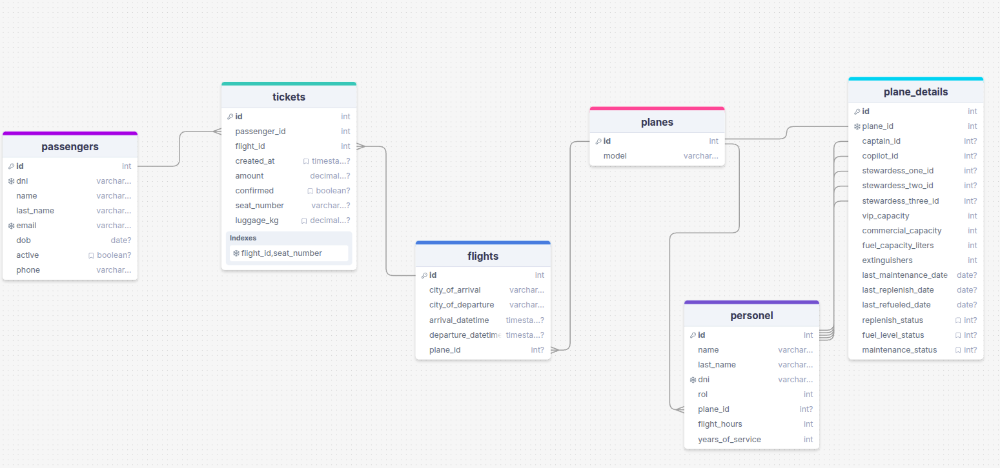
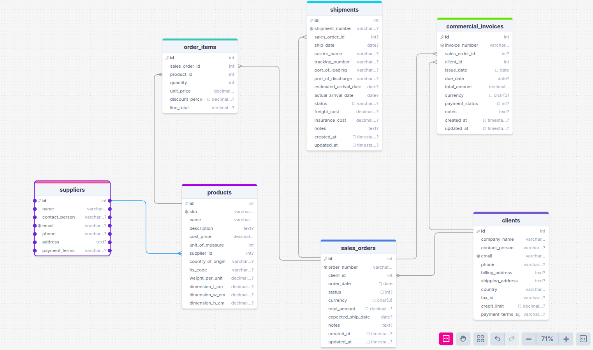
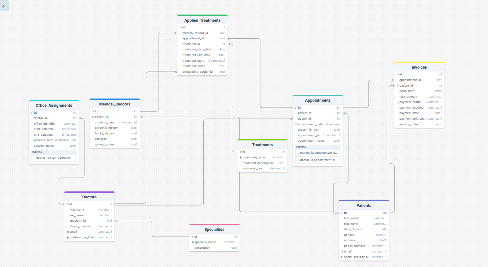
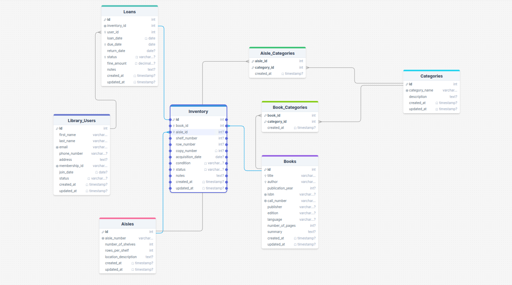
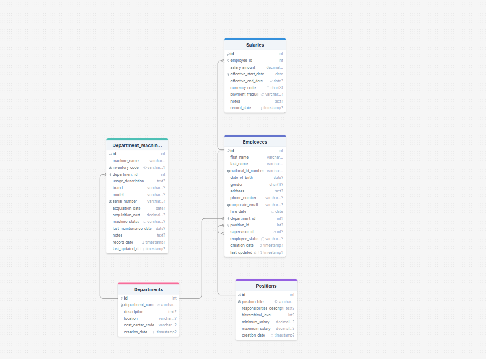

**Miguel Alejandro Figuera Quintero**
C.I: V-23.558.789
Seccion 8B

---

# Base de datos para una Aerolínea

---

## Tipos ENUM Definidos

Estos tipos sirven para restringir los valores que pueden tomar ciertas columnas a un conjunto predefinido, lo que ayuda a la integridad de los datos y a la claridad del esquema.

- **`replenished_status`**: Indica el estado de reabastecimiento de algo (probablemente suministros del avión).
  - Valores: '`pending`' (pendiente), '`replenished`' (reabastecido), '`empty`' (vacío), '`used`' (usado).
- **`fuel_status`**: Indica el estado del combustible.
  - Valores: '`refueled`' (repostado), '`pending`' (pendiente).
- **`maintenance_status`**: Indica el estado del mantenimiento.
  - Valores: '`pending`' (pendiente), '`performed`' (realizado).
- **`personel_rol`**: Define los roles del personal.
  - Valores: '`stewardess`' (azafata), '`copilot`' (copiloto), '`pilot`' (piloto), '`steward`' (asistente de vuelo, podría ser un sinónimo o un rol diferente).

---

## Descripción de cada Modelo (Tabla) y sus Relaciones

### 1. `planes` (Aviones)

- **Descripción:** Esta tabla almacena información sobre los aviones físicos que posee o opera la aerolínea. Cada fila representa un avión único.
- **Atributos Clave:**
  - `id` (identificador único del avión)
  - `model` (modelo del avión, ej. "Boeing 737")
- **Relaciones:**
  - **`has_many personel`**: Un avión `tiene muchos` miembros del personal, a través de la columna `personel.plane_id`. Esto sugiere que un miembro del personal puede estar asignado de forma principal o base a un avión específico.
  - **`has_many flights`**: Un avión `tiene muchos` vuelos, a través de la columna `flights.plane_id`. Un avión se utiliza para operar múltiples vuelos.
  - **`has_one plane_details`**: Un avión `tiene un` registro de detalles, a través de la columna `plane_details.plane_id` (que además es `UNIQUE NOT NULL`). Esto establece una relación uno-a-uno estricta: cada avión tiene exactamente un conjunto de detalles asociados, y si se borra el avión, sus detalles también se borran (`ON DELETE CASCADE`).

### 2. `passengers` (Pasajeros)

- **Descripción:** Almacena información sobre las personas que viajan o han viajado con la aerolínea.
- **Atributos Clave:**
  - `id` (identificador único del pasajero) Primary Key
  - `dni` (documento de identidad, único)
  - `name`
  - `last_name`
  - `email` (único)
  - `dob` (fecha de nacimiento)
  - `active` (si el registro del pasajero está activo)
  - `phone`
- **Relaciones:**
  - **`has_many tickets`**: Un pasajero `tiene muchos` boletos, a través de la columna `tickets.passenger_id`. Un pasajero puede comprar múltiples boletos para diferentes vuelos.

### 3. `personel` (Personal de la Aerolínea)

- **Descripción:** Contiene información sobre los empleados de la aerolínea que forman parte de la tripulación o tienen roles operativos relacionados con los vuelos/aviones.
- **Atributos Clave:**
  - `id` (identificador único del miembro del personal)
  - `name`
  - `last_name`
  - `dni` (documento de identidad, único)
  - `rol` (usando el ENUM `personel_rol`)
  - `plane_id` (a qué avión está asignado principalmente, puede ser `NULL`)
  - `flight_hours` (horas de vuelo acumuladas)
  - `years_of_service`
- **Relaciones:**
  - **`belongs_to plane`**: Un miembro del personal `pertenece a` un avión (opcionalmente), a través de la columna `personel.plane_id`. Indica una posible asignación base de este empleado a un avión en particular.
  - **Referenciado por `plane_details`**: Un miembro del personal `puede ser` capitán, copiloto o azafata en los detalles de un avión, a través de las columnas `captain_id`, `copilot_id`, `stewardess_one_id`, etc., en la tabla `plane_details`.

### 4. `flights` (Vuelos)

- **Descripción:** Registra la información de cada vuelo operado por la aerolínea, ya sea programado, en curso o completado.
- **Atributos Clave:**
  - `id` (identificador único del vuelo)
  - `city_of_arrival`
  - `city_of_departure`
  - `arrival_datetime` (fecha y hora de llegada)
  - `departure_datetime` (fecha y hora de salida)
  - `plane_id` (qué avión opera este vuelo)
- **Relaciones:**
  - **`belongs_to plane`**: Un vuelo `pertenece a` un avión, a través de la columna `flights.plane_id`. Cada vuelo es operado por un avión específico.
  - **`has_many tickets`**: Un vuelo `tiene muchos` boletos, a través de la columna `tickets.flight_id`. Múltiples boletos pueden ser vendidos para un mismo vuelo.

### 5. `tickets` (Boletos)

- **Descripción:** Representa los boletos o pasajes comprados por los pasajeros para vuelos específicos.
- **Atributos Clave:**
  - `id` (identificador único del boleto)
  - `passenger_id` (a qué pasajero pertenece)
  - `flight_id` (para qué vuelo es)
  - `created_at` (cuándo se emitió)
  - `amount` (precio)
  - `confirmed` (si está confirmado)
  - `seat_number` (número de asiento, único por vuelo: `UNIQUE INDEX idx_tickets_flight_seat`)
  - `luggage_kg` (peso del equipaje)
- **Relaciones:**
  - **`belongs_to passenger`**: Un boleto `pertenece a` un pasajero, a través de la columna `tickets.passenger_id`.
  - **`belongs_to flight`**: Un boleto `pertenece a` un vuelo, a través de la columna `tickets.flight_id`.

### 6. `plane_details` (Detalles del Avión)

- **Descripción:** Almacena información específica y detallada sobre un avión en particular, incluyendo su configuración de tripulación (para un vuelo o configuración tipo), capacidades, y estados de mantenimiento y suministros.
- **Atributos Clave:**
  - `id` (identificador único del registro de detalles)
  - `plane_id` (a qué avión pertenecen estos detalles, es `UNIQUE NOT NULL`)
  - `captain_id` (FK a `personel.id`)
  - `copilot_id` (FK a `personel.id`)
  - `stewardess_one_id` (FK a `personel.id`)
  - `stewardess_two_id` (FK a `personel.id`)
  - `stewardess_three_id` (FK a `personel.id`)
  - `vip_capacity`
  - `commercial_capacity`
  - `fuel_capacity_liters`
  - `extinguishers` (número de extintores)
  - `last_maintenance_date`
  - `last_replenish_date`
  - `last_refueled_date`
  - `replenish_status` (usa el ENUM `replenished_status`)
  - `fuel_level_status` (usa el ENUM `fuel_status`)
  - `maintenance_status` (usa el ENUM `maintenance_status`)
- **Relaciones:**
  - **`belongs_to plane`**: Los detalles del avión `pertenecen a` un avión, a través de la columna `plane_details.plane_id`. Es una relación **uno-a-uno** estricta.
  - **`has_one captain (from personel)`**: Los detalles del avión `tienen un` capitán (referencia a `personel`), a través de `plane_details.captain_id`.
  - **`has_one copilot (from personel)`**: Los detalles del avión `tienen un` copiloto (referencia a `personel`), a través de `plane_details.copilot_id`.
  - **`has_many stewardesses (represented as individual slots from personel)`**: Los detalles del avión `tienen varias` azafatas asignadas en "slots" individuales (cada una referencia a `personel`), a través de `stewardess_one_id`, `stewardess_two_id`, `stewardess_three_id`.

## Diagrama Entidad Relación para Aerolínea

---

# Base de datos para una Empresa Exportadora

---

## Tipos ENUM Definidos

Estos tipos definen conjuntos de valores permitidos para ciertas columnas, lo que ayuda a mantener la consistencia de los datos.

- **`unit_of_measure_enum`**: Define diversas unidades de medida para los productos.
  - Ejemplos: '`kg`', '`pieza`', '`caja`', '`metro`', etc.
  - _Nota:_ Hay dos definiciones de `unit_of_measure_enum` en el esquema original; se asume que la primera, más detallada, es la correcta o que la segunda es un remanente.
- **`order_status_enum`**: Define los posibles estados de un pedido de venta.
  - Ejemplos: '`pending_confirmation`', '`shipped`', '`completed`', '`cancelled`'.
- **`payment_status_enum`**: Define los posibles estados de pago de una factura.
  - Ejemplos: '`pending`', '`paid`', '`overdue`'.

---

## Descripción de cada Modelo (Tabla) y sus Relaciones

### 1. `suppliers` (Proveedores)

- **Descripción:** Esta tabla almacena información sobre las empresas o individuos que suministran productos a la empresa que utiliza esta base de datos.
- **Atributos Clave:**
  - `id` (identificador único)
  - `name` (nombre del proveedor)
  - `contact_person`
  - `email` (único)
  - `phone`
  - `address`
  - `payment_terms` (condiciones de pago acordadas con el proveedor)
- **Relaciones:**
  - **`has_many products`**: Un `supplier` puede suministrar muchos `products`, a través de la columna `products.supplier_id`.
  - _Nota sobre índice:_ El `CREATE INDEX idx_suppliers_name ON suppliers(email);` crea un índice llamado `idx_suppliers_name` sobre la columna `email`. Sería más claro si el nombre del índice fuera `idx_suppliers_email` o si el índice estuviera en la columna `name` si esa es la intención.

### 2. `products` (Productos)

- **Descripción:** Contiene la información detallada de cada artículo o producto que la empresa maneja, ya sea para comprar o vender.
- **Atributos Clave:**
  - `id` (identificador único)
  - `sku` (Stock Keeping Unit, código único del producto)
  - `name` (nombre del producto)
  - `description`
  - `cost_price` (precio de costo)
  - `unit_of_measure` (usa el ENUM `unit_of_measure_enum`)
  - `supplier_id` (quién suministra este producto, FK a `suppliers.id`)
  - `country_of_origin`
  - `hs_code` (código del Sistema Armonizado para aduanas)
  - `weight_per_unit`
  - `dimension_l_cm`, `dimension_w_cm`, `dimension_h_cm`
- **Relaciones:**
  - **`belongs_to supplier`**: Un `product` `pertenece a` un `supplier`, a través de la columna `products.supplier_id`. Si el proveedor es eliminado, el campo `supplier_id` en los productos asociados se establecerá en `NULL` (`ON DELETE SET NULL`).
  - **`has_many order_items`**: Un `product` puede estar en muchas líneas de pedido (`order_items`), a través de la columna `order_items.product_id`.

### 3. `clients` (Clientes)

- **Descripción:** Almacena información sobre los clientes (empresas o individuos) a los que la empresa vende sus productos.
- **Atributos Clave:**
  - `id` (identificador único)
  - `company_name`
  - `contact_person`
  - `email` (único)
  - `phone`
  - `billing_address` (dirección de facturación)
  - `shipping_address` (dirección de envío)
  - `country`
  - `tax_id` (identificación fiscal)
  - `credit_limit` (límite de crédito)
  - `payment_terms_agreed` (condiciones de pago acordadas con el cliente)
- **Relaciones:**
  - **`has_many sales_orders`**: Un `client` puede realizar muchos `sales_orders` (pedidos de venta), a través de `sales_orders.client_id`.
  - **`has_many commercial_invoices`**: A un `client` se le pueden emitir muchas `commercial_invoices` (facturas), a través de `commercial_invoices.client_id`.

### 4. `sales_orders` (Pedidos de Venta)

- **Descripción:** Registra los pedidos realizados por los clientes. Cada fila es un pedido.
- **Atributos Clave:**
  - `id` (identificador único)
  - `order_number` (número de pedido, único)
  - `client_id` (a qué cliente pertenece el pedido, FK a `clients.id`)
  - `order_date` (fecha del pedido)
  - `status` (usa el ENUM `order_status_enum`)
  - `currency` (moneda del pedido)
  - `total_amount` (monto total, probablemente calculado)
  - `expected_ship_date` (fecha esperada de envío)
  - `notes`
  - `created_at`, `updated_at`
- **Relaciones:**
  - **`belongs_to client`**: Un `sales_order` `pertenece a` un `client`, a través de `sales_orders.client_id`. Si se intenta borrar un cliente que tiene pedidos, la operación fallará (`ON DELETE RESTRICT`).
  - **`has_many order_items`**: Un `sales_order` se compone de varias `order_items` (líneas de productos), a través de `order_items.sales_order_id`.
  - **`has_many shipments`**: Un `sales_order` puede tener uno o varios `shipments` (envíos), a través de `shipments.sales_order_id`.
  - **`has_many commercial_invoices`**: Un `sales_order` puede generar una o varias `commercial_invoices` (facturas), a través de `commercial_invoices.sales_order_id`.

### 5. `order_items` (Líneas de Pedido de Venta)

- **Descripción:** Detalla cada producto individual dentro de un pedido de venta, incluyendo la cantidad y el precio. Es una tabla de unión entre `sales_orders` y `products`.
- **Atributos Clave:**
  - `id` (identificador único)
  - `sales_order_id` (a qué pedido pertenece, FK a `sales_orders.id`)
  - `product_id` (qué producto es, FK a `products.id`)
  - `quantity` (cantidad pedida)
  - `unit_price` (precio unitario)
  - `discount_percentage` (porcentaje de descuento)
  - `line_total` (total de la línea, probablemente calculado)
- **Relaciones:**
  - **`belongs_to sales_order`**: Un `order_item` `pertenece a` un `sales_order`, a través de `order_items.sales_order_id`. Si el pedido de venta se elimina, todas sus líneas de pedido también se eliminan (`ON DELETE CASCADE`).
  - **`belongs_to product`**: Un `order_item` `pertenece a` un `product`, a través de `order_items.product_id`. Si se intenta borrar un producto que está en una línea de pedido, la operación fallará (`ON DELETE RESTRICT`).

### 6. `shipments` (Envíos/Embarques)

- **Descripción:** Almacena información sobre los envíos físicos de los productos a los clientes.
- **Atributos Clave:**
  - `id` (identificador único)
  - `shipment_number` (número de envío, único)
  - `sales_order_id` (pedido asociado, FK a `sales_orders.id`)
  - `ship_date` (fecha de envío)
  - `carrier_name` (nombre del transportista)
  - `tracking_number` (número de seguimiento)
  - `port_of_loading` (puerto de carga)
  - `port_of_discharge` (puerto de descarga)
  - `estimated_arrival_date`
  - `actual_arrival_date`
  - `status` (estado del envío)
  - `freight_cost` (costo del flete)
  - `insurance_cost` (costo del seguro)
  - `notes`
  - `created_at`, `updated_at`
- **Relaciones:**
  - **`belongs_to sales_order`**: Un `shipment` `pertenece a` un `sales_order`, a través de `shipments.sales_order_id`. Si el pedido asociado se elimina, el `sales_order_id` en el envío se establecerá en `NULL` (`ON DELETE SET NULL`), permitiendo que el registro del envío persista por razones históricas.

### 7. `commercial_invoices` (Facturas Comerciales)

- **Descripción:** Registra las facturas emitidas a los clientes por los productos o servicios vendidos.
- **Atributos Clave:**
  - `id` (identificador único)
  - `invoice_number` (número de factura, único)
  - `sales_order_id` (pedido que generó la factura, FK a `sales_orders.id`)
  - `client_id` (cliente al que se factura, FK a `clients.id`)
  - `issue_date` (fecha de emisión)
  - `due_date` (fecha de vencimiento)
  - `total_amount` (monto total de la factura)
  - `currency` (moneda)
  - `payment_status` (usa el ENUM `payment_status_enum`)
  - `notes`
  - `created_at`, `updated_at`
- **Relaciones:**
  - **`belongs_to sales_order`**: Una `commercial_invoice` `pertenece a` un `sales_order`, a través de `commercial_invoices.sales_order_id`. Si el pedido asociado se elimina, el `sales_order_id` en la factura se establecerá en `NULL` (`ON DELETE SET NULL`).
  - **`belongs_to client`**: Una `commercial_invoice` `pertenece a` un `client`, a través de `commercial_invoices.client_id`. Se prohíbe eliminar un cliente si tiene facturas asociadas (`ON DELETE RESTRICT`).

## Diagrama Entidad Relación para Empresa Exportadora

---

# Base de Datos para un Consultorio Médico (`consultorio_medico`)

---

## Tipos de Datos Implícitos (Restricciones `CHECK` simulando ENUMs)

Este esquema utiliza restricciones `CHECK` con una lista de valores permitidos en ciertas columnas para definir conjuntos de valores válidos, similar a cómo funcionarían los tipos `ENUM` explícitos.

- **Para `Patients.gender`**: Define los géneros permitidos.
  - Valores: '`M`' (Masculino), '`F`' (Femenino), '`O`' (Otro).
- **Para `Appointments.appointment_status`**: Define los posibles estados de una cita.
  - Valores: '`Scheduled`', '`Confirmed`', '`Cancelled`', '`Completed`', '`No Show`'.
- **Para `Applied_Treatments.treatment_status`**: Define los posibles estados de un tratamiento aplicado.
  - Valores: '`Prescribed`', '`In Progress`', '`Completed`', '`Suspended`', '`Cancelled`'.
- **Para `Invoices.payment_status`**: Define los posibles estados de pago de una factura.
  - Valores: '`Pending`', '`Paid`', '`Partially Paid`', '`Cancelled`', '`Refunded`'.

---

## Descripción de cada Modelo (Tabla) y sus Relaciones

**Nota sobre `SERIAL PRIMARY KEY`**:
El tipo `SERIAL` en PostgreSQL es un atajo para crear una columna de tipo `INTEGER` que es `NOT NULL`, se auto-incrementa usando una secuencia asociada (creada automáticamente), y se establece como `PRIMARY KEY`. Esto asegura un identificador único para cada fila.

### 1. `Specialties` (Especialidades)

- **Descripción:** Almacena las diferentes especialidades médicas que pueden tener los doctores.
- **Atributos Clave:**
  - `id` (SERIAL, PK): Identificador único y auto-incremental de la especialidad.
  - `specialty_name` (VARCHAR(100), UNIQUE, NOT NULL): Nombre de la especialidad (ej. "Cardiology"). Es único.
  - `description` (TEXT): Descripción opcional de la especialidad.
- **Relaciones:**
  - **Referenciada por `Doctors`**: Una `Specialty` puede tener muchos `Doctors` asociados (a través de `Doctors.specialty_id`).

### 2. `Doctors` (Doctores)

- **Descripción:** Contiene información sobre los doctores del consultorio.
- **Atributos Clave:**
  - `id` (SERIAL, PK): Identificador único y auto-incremental del doctor.
  - `first_name` (VARCHAR(100), NOT NULL): Nombre del doctor.
  - `last_name` (VARCHAR(100), NOT NULL): Apellido del doctor.
  - `specialty_id` (INT, FK): Referencia al `id` en la tabla `Specialties`.
  - `phone_number` (VARCHAR(20)): Número de teléfono.
  - `email` (VARCHAR(100), UNIQUE): Dirección de correo electrónico única.
  - `professional_license_number` (VARCHAR(50), UNIQUE): Número de cédula o licencia profesional única.
- **Relaciones:**
  - **`belongs_to Specialty`**: Un `Doctor` está asociado a una `Specialty` (a través de `Doctors.specialty_id`).
    - `ON DELETE SET NULL`: Si se borra una especialidad, el campo `specialty_id` del doctor se establecerá en `NULL`.
  - **`has_many Appointments`**: Un `Doctor` puede tener muchas `Appointments` (a través de `Appointments.doctor_id`).
  - **`has_many Office_Assignments`**: Un `Doctor` puede tener muchas asignaciones de consultorio (`Office_Assignments.doctor_id`).
  - **Puede prescribir `Applied_Treatments`**: Un `Doctor` puede ser el `prescribing_doctor_id` en `Applied_Treatments`.

### 3. `Patients` (Pacientes)

- **Descripción:** Almacena información sobre los pacientes del consultorio.
- **Atributos Clave:**
  - `id` (SERIAL, PK): Identificador único y auto-incremental del paciente.
  - `first_name` (VARCHAR(100), NOT NULL): Nombre del paciente.
  - `last_name` (VARCHAR(100), NOT NULL): Apellido del paciente.
  - `date_of_birth` (DATE, NOT NULL): Fecha de nacimiento.
  - `gender` (CHAR(1)): Género del paciente (restringido por `CHECK`).
  - `address` (TEXT): Dirección del paciente.
  - `phone_number` (VARCHAR(20)): Número de teléfono.
  - `email` (VARCHAR(100), UNIQUE): Dirección de correo electrónico única.
  - `social_security_number` (VARCHAR(50), UNIQUE): Número de seguro social o identificación similar, único.
- **Relaciones:**
  - **`has_one Medical_Record`**: Un `Patient` tiene un `Medical_Record` (a través de `Medical_Records.patient_id`, que es `UNIQUE`).
  - **`has_many Appointments`**: Un `Patient` puede tener muchas `Appointments` (a través de `Appointments.patient_id`).
  - **`has_many Invoices`**: Un `Patient` puede tener muchas `Invoices` (a través de `Invoices.patient_id`).

### 4. `Medical_Records` (Historias Médicas)

- **Descripción:** Guarda la historia clínica general de cada paciente.
- **Atributos Clave:**
  - `id` (SERIAL, PK): Identificador único y auto-incremental de la historia médica.
  - `patient_id` (INT, NOT NULL, UNIQUE, FK): Referencia al `id` en la tabla `Patients`. Indica a qué paciente pertenece esta historia. La restricción `UNIQUE` asegura una única historia por paciente.
  - `creation_date` (TIMESTAMP WITHOUT TIME ZONE, DEFAULT CURRENT_TIMESTAMP): Fecha y hora de creación del registro.
  - `personal_history` (TEXT): Antecedentes personales del paciente.
  - `family_history` (TEXT): Antecedentes familiares.
  - `allergies` (TEXT): Alergias conocidas.
  - `general_notes` (TEXT): Notas generales sobre la historia médica.
- **Relaciones:**
  - **`belongs_to Patient`**: Un `Medical_Record` pertenece a un único `Patient` (a través de `Medical_Records.patient_id`).
    - `ON DELETE CASCADE`: Si se borra un paciente, su historia médica también se borra.
  - **`has_many Applied_Treatments`**: Un `Medical_Record` puede tener asociados varios `Applied_Treatments` (a través de `Applied_Treatments.medical_record_id`).

### 5. `Appointments` (Citas)

- **Descripción:** Registra las citas programadas entre pacientes y doctores.
- **Atributos Clave:**
  - `id` (SERIAL, PK): Identificador único y auto-incremental de la cita.
  - `patient_id` (INT, NOT NULL, FK): Paciente de la cita.
  - `doctor_id` (INT, NOT NULL, FK): Doctor de la cita.
  - `appointment_datetime` (TIMESTAMP WITHOUT TIME ZONE, NOT NULL): Fecha y hora de la cita.
  - `reason_for_visit` (TEXT): Motivo de la consulta.
  - `appointment_status` (VARCHAR(20), DEFAULT 'Scheduled'): Estado de la cita (restringido por `CHECK`).
  - `appointment_notes` (TEXT): Notas específicas de la cita.
- **Relaciones:**
  - **`belongs_to Patient`**: Una `Appointment` pertenece a un `Patient` (a través de `Appointments.patient_id`).
    - `ON DELETE CASCADE`: Si se borra el paciente, sus citas se borran.
  - **`belongs_to Doctor`**: Una `Appointment` es con un `Doctor` (a través de `Appointments.doctor_id`).
    - `ON DELETE RESTRICT`: No se puede borrar un doctor si tiene citas asociadas (la operación fallará).
  - **`has_many Applied_Treatments`**: Una `Appointment` puede tener asociados varios `Applied_Treatments` (a través de `Applied_Treatments.appointment_id`).
  - **`has_many Invoices`**: Una `Appointment` puede generar `Invoices` (a través de `Invoices.appointment_id`).
- **Índices:**
  - `idx_appointments_datetime`: Para búsquedas rápidas por fecha y hora de la cita.
  - `idx_appointments_doctor_datetime`: Para búsquedas rápidas por doctor y fecha/hora.
  - `idx_appointments_patient_datetime`: Para búsquedas rápidas por paciente y fecha/hora.

### 6. `Office_Assignments` (Asignaciones de Consultorio)

- **Descripción:** Registra cuándo un doctor ocupa un determinado consultorio o sala.
- **Atributos Clave:**
  - `id` (SERIAL, PK): Identificador único y auto-incremental de la asignación.
  - `doctor_id` (INT, NOT NULL, FK): Doctor asignado.
  - `office_identifier` (VARCHAR(20), NOT NULL): Identificador del consultorio (ej. "Room 1", "Office A").
  - `start_datetime` (TIMESTAMP WITHOUT TIME ZONE, NOT NULL): Fecha y hora de inicio de la ocupación.
  - `end_datetime` (TIMESTAMP WITHOUT TIME ZONE, NOT NULL): Fecha y hora de fin de la ocupación.
  - `patients_seen_in_session` (INT, DEFAULT 0): Número de pacientes atendidos durante esa sesión.
  - `session_notes` (TEXT): Notas sobre la sesión.
  - `CONSTRAINT chk_assignment_datetimes`: Asegura que `end_datetime` sea posterior a `start_datetime`.
- **Relaciones:**
  - **`belongs_to Doctor`**: Una `Office_Assignment` es para un `Doctor` (a través de `Office_Assignments.doctor_id`).
    - `ON DELETE CASCADE`: Si se borra el doctor, sus asignaciones de consultorio se borran.
- **Índices:**
  - `idx_assignment_doctor_datetime`: Para búsquedas rápidas por doctor y fecha/hora de inicio.

### 7. `Treatments` (Tratamientos - Catálogo)

- **Descripción:** Catálogo de los diferentes tipos de tratamientos que se pueden ofrecer o prescribir.
- **Atributos Clave:**
  - `id` (SERIAL, PK): Identificador único y auto-incremental del tratamiento.
  - `treatment_name` (VARCHAR(255), UNIQUE, NOT NULL): Nombre del tratamiento (ej. "Hypertension Management"). Es único.
  - `treatment_description` (TEXT): Descripción del tratamiento.
  - `estimated_cost` (DECIMAL(10, 2)): Costo estimado base del tratamiento.
- **Relaciones:**
  - **Referenciada por `Applied_Treatments`**: Un `Treatment` del catálogo puede ser aplicado múltiples veces (a través de `Applied_Treatments.treatment_id`).

### 8. `Applied_Treatments` (Tratamientos Aplicados)

- **Descripción:** Tabla que registra la aplicación o prescripción de un tratamiento específico a un paciente, ya sea en el contexto de su historia médica general o de una cita particular.
- **Atributos Clave:**
  - `id` (SERIAL, PK): Identificador único y auto-incremental del tratamiento aplicado.
  - `medical_record_id` (INT, FK): Opcional, referencia a la historia médica general.
  - `appointment_id` (INT, FK): Opcional, referencia a una cita específica.
  - `treatment_id` (INT, NOT NULL, FK): Referencia al tratamiento en el catálogo `Treatments`.
  - `treatment_start_date` (DATE, NOT NULL): Fecha de inicio del tratamiento.
  - `treatment_end_date` (DATE): Fecha de fin del tratamiento (si aplica).
  - `treatment_status` (VARCHAR(50), DEFAULT 'Prescribed'): Estado del tratamiento aplicado (restringido por `CHECK`).
  - `treatment_notes` (TEXT): Notas específicas sobre este tratamiento aplicado.
  - `prescribing_doctor_id` (INT, FK): Doctor que prescribió o está supervisando este tratamiento.
  - `CONSTRAINT chk_record_or_appointment`: Asegura que el tratamiento aplicado esté vinculado al menos a una historia médica o a una cita (o ambas).
- **Relaciones:**
  - **`belongs_to Medical_Record` (opcional)**: Un `Applied_Treatment` puede estar asociado a un `Medical_Record`.
    - `ON DELETE CASCADE`: Si se borra la historia médica, los tratamientos aplicados asociados a ella se borran.
  - **`belongs_to Appointment` (opcional)**: Un `Applied_Treatment` puede estar asociado a una `Appointment`.
    - `ON DELETE SET NULL`: Si se borra la cita, el `appointment_id` en `Applied_Treatments` se pone a `NULL` (el registro del tratamiento persiste, pero desvinculado de esa cita).
  - **`belongs_to Treatment` (catálogo)**: Un `Applied_Treatment` es una instancia de un `Treatment` del catálogo.
    - `ON DELETE RESTRICT`: No se puede borrar un tratamiento del catálogo si está siendo referenciado aquí (la operación fallará).
  - **`belongs_to Doctor` (prescriptor)**: Un `Doctor` prescribe el `Applied_Treatment`.
    - `ON DELETE SET NULL`: Si se borra el doctor prescriptor, el campo `prescribing_doctor_id` se pone a `NULL`.

### 9. `Invoices` (Facturas)

- **Descripción:** Almacena la información de las facturas generadas por consultas o tratamientos.
- **Atributos Clave:**
  - `id` (SERIAL, PK): Identificador único y auto-incremental de la factura.
  - `appointment_id` (INT, FK): Opcional, cita que generó esta factura.
  - `patient_id` (INT, NOT NULL, FK): Paciente al que se le emite la factura.
  - `issue_date` (DATE, NOT NULL, DEFAULT CURRENT_DATE): Fecha de emisión de la factura.
  - `total_amount` (DECIMAL(10, 2), NOT NULL): Monto total de la factura.
  - `payment_status` (VARCHAR(20), DEFAULT 'Pending'): Estado del pago (restringido por `CHECK`).
  - `payment_method` (VARCHAR(50)): Método de pago utilizado.
  - `payment_date` (DATE): Fecha en que se realizó el pago.
  - `payment_reference` (VARCHAR(100)): Referencia del pago (ej. número de transacción).
  - `invoice_notes` (TEXT): Notas adicionales sobre la factura.
- **Relaciones:**
  - **`belongs_to Appointment` (opcional)**: Una `Invoice` puede estar asociada a una `Appointment`.
    - `ON DELETE SET NULL`: Si se borra la cita, el `appointment_id` en `Invoices` se pone a `NULL` (la factura persiste).
  - **`belongs_to Patient`**: Una `Invoice` se emite a un `Patient`.
    - `ON DELETE RESTRICT`: No se puede borrar un paciente si tiene facturas asociadas (la operación fallará).
- **Índices:**

  - `idx_invoice_patient`: Para búsquedas rápidas por paciente.
  - `idx_invoice_payment_status`: Para búsquedas rápidas por estado de pago.

  ## Diagrama Entidad relacion para consultorio medico.

  

---

# Base de Datos para un Sistema de Biblioteca (`library_system`)

---

## Tipos de Datos Implícitos (Restricciones `CHECK` simulando ENUMs)

Este esquema utiliza restricciones `CHECK` en varias columnas para definir un conjunto de valores permitidos, funcionando de manera similar a los tipos `ENUM` explícitos de PostgreSQL.

- **Para `Library_Users.status`**: Define los estados de membresía de un usuario.
  - Valores: '`Active`', '`Suspended`', '`Inactive`'.
- **Para `Inventory.condition`**: Define el estado físico de una copia de un libro.
  - Valores: '`New`', '`Good`', '`Fair`', '`Poor`', '`Damaged`', '`Lost`'.
- **Para `Inventory.status`**: Define la disponibilidad de una copia de un libro.
  - Valores: '`Available`', '`On Loan`', '`Reserved`', '`In Repair`', '`Lost`'.
- **Para `Loans.status`**: Define el estado de un préstamo.
  - Valores: '`Active`', '`Returned`', '`Overdue`', '`Lost`'.

---

## Descripción de cada Modelo (Tabla) y sus Relaciones

**Nota sobre `SERIAL PRIMARY KEY`**:
El tipo `SERIAL` en PostgreSQL es un atajo para crear una columna de tipo `INTEGER` que es `NOT NULL`, se auto-incrementa usando una secuencia asociada (creada automáticamente por detrás), y se establece como `PRIMARY KEY`. Esto proporciona un identificador único para cada fila de la tabla.

**Nota sobre `created_at` y `updated_at`**:
La mayoría de las tablas incluyen estas columnas `TIMESTAMP WITHOUT TIME ZONE` con `DEFAULT CURRENT_TIMESTAMP` para `created_at`. Estas sirven para rastrear cuándo se creó un registro y cuándo se actualizó por última vez. El script original incluía una función y triggers para actualizar automáticamente `updated_at`, pero no están en el fragmento que proporcionaste ahora (se pueden añadir si es necesario).

### 1. `Aisles` (Pasillos)

- **Descripción:** Almacena información sobre los pasillos físicos dentro de la biblioteca.
- **Atributos Clave:**
  - `id` (SERIAL, PK): Identificador único y auto-incremental del pasillo.
  - `aisle_number` (VARCHAR(10), UNIQUE, NOT NULL): Número o código identificador del pasillo (ej. "A1", "B2-Norte"). Es único.
  - `number_of_shelves` (INT, NOT NULL, CHECK > 0): Cantidad de estantes en el pasillo.
  - `rows_per_shelf` (INT, NOT NULL, CHECK > 0): Cantidad de filas en cada estante.
  - `location_description` (TEXT): Descripción textual de la ubicación del pasillo (ej. "Sección de Ficción, Primer Piso").
  - `created_at` (TIMESTAMP): Fecha y hora de creación del registro.
  - `updated_at` (TIMESTAMP): Fecha y hora de la última actualización del registro.
- **Relaciones:**
  - **`has_many Inventory`**: Un `Aisle` puede contener muchas copias de libros (`Inventory`) (a través de `Inventory.aisle_id`).
  - **`has_many Aisle_Categories`**: Un `Aisle` puede estar asociado con múltiples `Categories` (a través de la tabla de unión `Aisle_Categories`).

### 2. `Books` (Libros)

- **Descripción:** Contiene la información detallada de cada título de libro (edición específica).
- **Atributos Clave:**
  - `id` (SERIAL, PK): Identificador único y auto-incremental del libro.
  - `title` (VARCHAR(255), NOT NULL): Título del libro.
  - `author` (VARCHAR(255), NOT NULL): Autor(es) del libro.
  - `publication_year` (INT, CHECK): Año de publicación. La restricción permite años futuros por si se catalogan libros aún no publicados.
  - `isbn` (VARCHAR(20), UNIQUE): Número Estándar Internacional de Libro. Es único pero puede ser nulo.
  - `call_number` (VARCHAR(50), UNIQUE, NOT NULL): Cota o signatura topográfica única que la biblioteca usa para localizar el libro físicamente.
  - `publisher` (VARCHAR(150)): Editorial.
  - `edition` (VARCHAR(50)): Edición del libro.
  - `language` (VARCHAR(50)): Idioma del libro.
  - `number_of_pages` (INT, CHECK > 0): Número de páginas.
  - `summary` (TEXT): Resumen o sinopsis del libro.
  - `created_at` (TIMESTAMP): Fecha y hora de creación del registro.
  - `updated_at` (TIMESTAMP): Fecha y hora de la última actualización del registro.
- **Relaciones:**
  - **`has_many Inventory`**: Un `Book` (título/edición) puede tener múltiples copias físicas en el `Inventory` (a través de `Inventory.book_id`).
  - **`has_many Book_Categories`**: Un `Book` puede pertenecer a múltiples `Categories` (a través de la tabla de unión `Book_Categories`).
- **Índices:**
  - `idx_books_title`: Para búsquedas rápidas por título.
  - `idx_books_author`: Para búsquedas rápidas por autor.
  - `idx_books_call_number`: Para búsquedas rápidas por cota.

### 3. `Library_Users` (Usuarios de la Biblioteca)

- **Descripción:** Almacena información sobre los miembros o usuarios de la biblioteca.
- **Atributos Clave:**
  - `id` (SERIAL, PK): Identificador único y auto-incremental del usuario.
  - `first_name` (VARCHAR(100), NOT NULL): Nombre del usuario.
  - `last_name` (VARCHAR(100), NOT NULL): Apellido del usuario.
  - `email` (VARCHAR(100), UNIQUE, NOT NULL): Dirección de correo electrónico única.
  - `phone_number` (VARCHAR(20)): Número de teléfono.
  - `address` (TEXT): Dirección del usuario.
  - `membership_id` (VARCHAR(50), UNIQUE, NOT NULL): Número de carnet o identificación de membresía único.
  - `join_date` (DATE, DEFAULT CURRENT_DATE): Fecha en que el usuario se unió.
  - `status` (VARCHAR(20), DEFAULT 'Active'): Estado de la membresía (restringido por `CHECK`).
  - `created_at` (TIMESTAMP): Fecha y hora de creación del registro.
  - `updated_at` (TIMESTAMP): Fecha y hora de la última actualización del registro.
- **Relaciones:**
  - **`has_many Loans`**: Un `Library_User` puede tener muchos `Loans` (a través de `Loans.user_id`).
- **Índices:**
  - `idx_library_users_email`: Para búsquedas rápidas por email.
  - `idx_library_users_membership_id`: Para búsquedas rápidas por número de membresía.

### 4. `Inventory` (Inventario)

- **Descripción:** Tabla crucial que rastrea cada copia física individual de un libro, su ubicación y estado.
- **Atributos Clave:**
  - `id` (SERIAL, PK): Identificador único para cada copia física del libro.
  - `book_id` (INT, NOT NULL, FK): Referencia al `id` en la tabla `Books`, indicando a qué título de libro pertenece esta copia.
  - `aisle_id` (INT, FK): Opcional, referencia al `id` en la tabla `Aisles`, indicando el pasillo donde se ubica generalmente esta copia.
  - `shelf_number` (INT): Número de estante dentro del pasillo.
  - `row_number` (INT): Número de fila dentro del estante.
  - `copy_number` (INT, DEFAULT 1): Número de copia, útil si hay varias copias idénticas del mismo libro/edición.
  - `acquisition_date` (DATE): Fecha en que la biblioteca adquirió esta copia.
  - `condition` (VARCHAR(50), DEFAULT 'Good'): Estado físico de la copia (restringido por `CHECK`).
  - `status` (VARCHAR(20), DEFAULT 'Available'): Estado de disponibilidad de la copia (restringido por `CHECK`).
  - `notes` (TEXT): Notas adicionales sobre esta copia específica.
  - `created_at` (TIMESTAMP): Fecha y hora de creación del registro.
  - `updated_at` (TIMESTAMP): Fecha y hora de la última actualización del registro.
- **Relaciones:**
  - **`belongs_to Book`**: Una `Inventory` (copia) pertenece a un `Book` (título/edición) (a través de `Inventory.book_id`).
    - `ON DELETE CASCADE`: Si se elimina el registro del libro (título/edición), todas sus copias en inventario también se eliminan.
  - **`belongs_to Aisle` (opcional)**: Una `Inventory` (copia) puede estar ubicada en un `Aisle` (a través de `Inventory.aisle_id`).
    - `ON DELETE SET NULL`: Si se elimina un pasillo, la ubicación de la copia (`aisle_id`) se establece en `NULL` (queda como ubicación desconocida).
  - **`has_one Loan` (activo a la vez)**: Una `Inventory` (copia específica) puede estar en un `Loan` a la vez (la columna `Loans.inventory_id` es `UNIQUE`).
- **Índices:**
  - `idx_inventory_book_id`: Para búsquedas rápidas por el libro al que pertenece la copia.
  - `idx_inventory_aisle_id`: Para búsquedas rápidas por pasillo.
  - `idx_inventory_status`: Para búsquedas rápidas por estado de disponibilidad.

### 5. `Loans` (Préstamos)

- **Descripción:** Registra los préstamos de copias de libros a los usuarios.
- **Atributos Clave:**
  - `id` (SERIAL, PK): Identificador único del préstamo.
  - `inventory_id` (INT, NOT NULL, UNIQUE, FK): Referencia al `id` en `Inventory`, identificando la copia física específica que se prestó. Es `UNIQUE` porque una copia física solo puede estar en un préstamo activo a la vez.
  - `user_id` (INT, NOT NULL, FK): Referencia al `id` en `Library_Users`, identificando al usuario que tomó prestado el libro.
  - `loan_date` (DATE, NOT NULL, DEFAULT CURRENT_DATE): Fecha en que se realizó el préstamo.
  - `due_date` (DATE, NOT NULL): Fecha de vencimiento del préstamo.
  - `return_date` (DATE): Fecha en que se devolvió el libro (NULL si aún no se ha devuelto).
  - `status` (VARCHAR(20), DEFAULT 'Active'): Estado del préstamo (restringido por `CHECK`).
  - `fine_amount` (DECIMAL(8, 2), DEFAULT 0.00): Monto de la multa acumulada, si aplica.
  - `notes` (TEXT): Notas adicionales sobre el préstamo.
  - `created_at` (TIMESTAMP): Fecha y hora de creación del registro.
  - `updated_at` (TIMESTAMP): Fecha y hora de la última actualización del registro.
  - `CONSTRAINT chk_loan_dates`: Asegura que `due_date` sea igual o posterior a `loan_date`.
  - `CONSTRAINT chk_return_date`: Asegura que `return_date`, si existe, sea igual o posterior a `loan_date`.
- **Relaciones:**
  - **`belongs_to Inventory`**: Un `Loan` involucra una `Inventory` (copia específica) (a través de `Loans.inventory_id`).
    - `ON DELETE RESTRICT`: No se puede eliminar una copia del inventario si está actualmente en un préstamo (la operación fallará).
  - **`belongs_to Library_User`**: Un `Loan` es realizado por un `Library_User` (a través de `Loans.user_id`).
    - `ON DELETE RESTRICT`: No se puede eliminar un usuario si tiene préstamos activos o históricos (la operación fallará).
- **Índices:**
  - `idx_loans_inventory_id`: Para búsquedas rápidas por la copia prestada.
  - `idx_loans_user_id`: Para búsquedas rápidas por usuario.
  - `idx_loans_due_date`: Para búsquedas rápidas por fecha de vencimiento.
  - `idx_loans_status`: Para búsquedas rápidas por estado del préstamo.

### 6. `Categories` (Categorías)

- **Descripción:** Tabla catálogo para listar todas las categorías o géneros disponibles (ej. "Ficción", "Ciencia", "Historia").
- **Atributos Clave:**
  - `id` (SERIAL, PK): Identificador único y auto-incremental de la categoría.
  - `category_name` (VARCHAR(100), UNIQUE, NOT NULL): Nombre de la categoría. Es único.
  - `description` (TEXT): Descripción opcional de la categoría.
  - `created_at` (TIMESTAMP): Fecha y hora de creación del registro.
  - `updated_at` (TIMESTAMP): Fecha y hora de la última actualización del registro.
- **Relaciones:**
  - **`has_many Book_Categories`**: Una `Category` puede estar asociada con múltiples `Books` (a través de la tabla de unión `Book_Categories`).
  - **`has_many Aisle_Categories`**: Una `Category` puede estar asociada con múltiples `Aisles` (a través de la tabla de unión `Aisle_Categories`).

### 7. `Book_Categories` (Categorías de Libros - Tabla de Unión)

- **Descripción:** Resuelve la relación muchos-a-muchos entre `Books` y `Categories`. Un libro puede pertenecer a varias categorías, y una categoría puede contener muchos libros.
- **Atributos Clave:**
  - `book_id` (INT, NOT NULL, FK): Referencia al `id` en `Books`.
  - `category_id` (INT, NOT NULL, FK): Referencia al `id` en `Categories`.
  - `created_at` (TIMESTAMP): Fecha y hora de creación de la asociación.
  - `PRIMARY KEY (book_id, category_id)`: La clave primaria es compuesta, asegurando que un libro no pueda ser asignado a la misma categoría más de una vez.
- **Relaciones:**
  - **`belongs_to Book`**: Cada registro en `Book_Categories` vincula un `Book` específico.
    - `ON DELETE CASCADE`: Si se elimina un libro, todas sus asociaciones de categoría también se eliminan.
  - **`belongs_to Category`**: Cada registro en `Book_Categories` vincula una `Category` específica.
    - `ON DELETE CASCADE`: Si se elimina una categoría, todas sus asociaciones con libros también se eliminan.

### 8. `Aisle_Categories` (Categorías de Pasillos - Tabla de Unión)

- **Descripción:** Resuelve la relación muchos-a-muchos entre `Aisles` y `Categories`. Un pasillo puede albergar predominantemente libros de ciertas categorías, y una categoría puede encontrarse en varios pasillos.
- **Atributos Clave:**
  - `aisle_id` (INT, NOT NULL, FK): Referencia al `id` en `Aisles`.
  - `category_id` (INT, NOT NULL, FK): Referencia al `id` en `Categories`.
  - `created_at` (TIMESTAMP): Fecha y hora de creación de la asociación.
  - `PRIMARY KEY (aisle_id, category_id)`: La clave primaria es compuesta, asegurando que un pasillo no pueda ser asignado a la misma categoría más de una vez.
- **Relaciones:**

  - **`belongs_to Aisle`**: Cada registro en `Aisle_Categories` vincula un `Aisle` específico.
    - `ON DELETE CASCADE`: Si se elimina un pasillo, todas sus asociaciones de categoría también se eliminan.
  - **`belongs_to Category`**: Cada registro en `Aisle_Categories` vincula una `Category` específica.

    - `ON DELETE CASCADE`: Si se elimina una categoría, todas sus asociaciones con pasillos también se eliminan.

    ## Diagrama entidad relacion para una biblioteca

    

---

# Base de Datos para Gestión de Empresa (`company_management`)

---

## Tipos de Datos Implícitos (Restricciones `CHECK` simulando ENUMs)

Este esquema utiliza restricciones `CHECK` en varias columnas para definir un conjunto de valores permitidos, funcionando de manera similar a los tipos `ENUM` explícitos de PostgreSQL.

- **Para `Employees.gender`**: Define los géneros permitidos para los empleados.
  - Valores: '`M`' (Masculino), '`F`' (Femenino), '`O`' (Otro).
- **Para `Employees.employee_status`**: Define los posibles estados de un empleado.
  - Valores: '`Active`', '`Inactive`', '`Suspended`', '`Terminated`'.
- **Para `Salaries.payment_frequency`**: Define la frecuencia con la que se paga un salario.
  - Valores: '`Weekly`', '`Bi-Weekly`' (Quincenal), '`Monthly`', '`Annual`'.
- **Para `Department_Machinery.machine_status`**: Define el estado operativo de una máquina.
  - Valores: '`Operational`', '`Under Maintenance`', '`Damaged`', '`Obsolete`', '`Decommissioned`' (De Baja).

---

## Descripción de cada Modelo (Tabla) y sus Relaciones

**Nota sobre `SERIAL PRIMARY KEY`**:
El tipo `SERIAL` en PostgreSQL es un atajo para crear una columna de tipo `INTEGER` que es `NOT NULL`, se auto-incrementa usando una secuencia asociada (creada automáticamente), y se establece como `PRIMARY KEY`. Esto proporciona un identificador único para cada fila.

**Nota sobre `creation_date` y `last_updated_date`**:
La mayoría de las tablas incluyen estas columnas `TIMESTAMP WITHOUT TIME ZONE`. `creation_date` generalmente tiene `DEFAULT CURRENT_TIMESTAMP` para registrar cuándo se creó un registro. `last_updated_date` está destinada a registrar cuándo se actualizó por última vez un registro. El script incluye una función (`update_last_updated_date_column`) y triggers para automatizar la actualización de `last_updated_date` en algunas tablas.

### 1. `Departments` (Departamentos)

- **Descripción:** Almacena información sobre los diferentes departamentos o unidades organizativas dentro de la empresa.
- **Atributos Clave:**
  - `id` (SERIAL, PK): Identificador único y auto-incremental del departamento.
  - `department_name` (VARCHAR(100), UNIQUE, NOT NULL): Nombre del departamento (ej. "Sales", "Human Resources"). Es único.
  - `description` (TEXT): Descripción de las funciones del departamento.
  - `location` (VARCHAR(100)): Ubicación física del departamento (ej. "Building A, 3rd Floor").
  - `cost_center_code` (VARCHAR(50)): Código de centro de costos para fines contables (opcional).
  - `creation_date` (TIMESTAMP): Fecha y hora de creación del registro del departamento.
- **Relaciones:**
  - **`has_many Employees`**: Un `Department` puede tener muchos `Employees` asignados (a través de `Employees.department_id`).
  - **`has_many Department_Machinery`**: Un `Department` puede tener mucha `Department_Machinery` asignada (a través de `Department_Machinery.department_id`).

### 2. `Positions` (Cargos/Puestos)

- **Descripción:** Define los diferentes cargos o puestos de trabajo que existen dentro de la estructura de la empresa.
- **Atributos Clave:**
  - `id` (SERIAL, PK): Identificador único y auto-incremental del cargo.
  - `position_title` (VARCHAR(100), UNIQUE, NOT NULL): Nombre del cargo (ej. "Sales Manager", "Systems Analyst"). Es único.
  - `responsibilities_description` (TEXT): Descripción de las responsabilidades y tareas asociadas al cargo.
  - `hierarchical_level` (INT): Nivel jerárquico del cargo (ej. 1 para operativo, 3 para gerencial).
  - `minimum_salary` (DECIMAL(10, 2), CHECK >= 0): Salario mínimo para este cargo.
  - `maximum_salary` (DECIMAL(10, 2), CHECK >= `minimum_salary`): Salario máximo para este cargo.
  - `creation_date` (TIMESTAMP): Fecha y hora de creación del registro del cargo.
- **Relaciones:**
  - **`has_many Employees`**: Un `Position` puede ser ocupado por muchos `Employees` (a través de `Employees.position_id`).

### 3. `Employees` (Empleados)

- **Descripción:** Contiene la información detallada de cada persona que trabaja en la empresa.
- **Atributos Clave:**
  - `id` (SERIAL, PK): Identificador único y auto-incremental del empleado.
  - `first_name` (VARCHAR(100), NOT NULL): Nombre del empleado.
  - `last_name` (VARCHAR(100), NOT NULL): Apellido del empleado.
  - `national_id_number` (VARCHAR(20), UNIQUE, NOT NULL): Número de identificación nacional (DNI, Cédula, etc.). Es único.
  - `date_of_birth` (DATE): Fecha de nacimiento.
  - `gender` (CHAR(1), CHECK): Género del empleado.
  - `address` (TEXT): Dirección residencial del empleado.
  - `phone_number` (VARCHAR(20)): Número de teléfono.
  - `corporate_email` (VARCHAR(100), UNIQUE): Dirección de correo electrónico corporativo. Es única.
  - `hire_date` (DATE, NOT NULL, DEFAULT CURRENT_DATE): Fecha de contratación del empleado.
  - `department_id` (INT, FK): Referencia al `id` en la tabla `Departments`.
  - `position_id` (INT, FK): Referencia al `id` en la tabla `Positions`.
  - `supervisor_id` (INT, FK): Referencia al `id` de otro `Employee` que es su supervisor directo (auto-referencia).
  - `employee_status` (VARCHAR(20), DEFAULT 'Active', CHECK): Estado actual del empleado.
  - `creation_date` (TIMESTAMP): Fecha y hora de creación del registro.
  - `last_updated_date` (TIMESTAMP): Fecha y hora de la última actualización del registro.
- **Relaciones:**
  - **`belongs_to Department`**: Un `Employee` está asignado a un `Department` (a través de `Employees.department_id`).
    - `ON DELETE SET NULL`: Si se elimina el departamento, el `department_id` del empleado se establece en `NULL`.
  - **`belongs_to Position`**: Un `Employee` ocupa un `Position` (a través de `Employees.position_id`).
    - `ON DELETE SET NULL`: Si se elimina el cargo, el `position_id` del empleado se establece en `NULL`.
  - **`belongs_to Employee` (como supervisor)**: Un `Employee` puede tener un supervisor, que es otro `Employee` (a través de `Employees.supervisor_id`).
    - `ON DELETE SET NULL`: Si se elimina el supervisor, el `supervisor_id` del empleado se establece en `NULL`.
  - **`has_many Employees` (como subordinados)**: Un `Employee` puede ser supervisor de muchos otros `Employees`.
  - **`has_many Salaries`**: Un `Employee` tiene un historial de `Salaries` (a través de `Salaries.employee_id`).
- **Índices:**
  - `idx_employees_department`: Para búsquedas rápidas por departamento.
  - `idx_employees_position`: Para búsquedas rápidas por cargo.
  - `idx_employees_email`: Para búsquedas rápidas por email corporativo.

### 4. `Salaries` (Sueldos)

- **Descripción:** Mantiene un registro histórico de los sueldos asignados a los empleados. Es útil para auditorías y seguimiento de la compensación.
- **Atributos Clave:**
  - `id` (SERIAL, PK): Identificador único del registro de sueldo.
  - `employee_id` (INT, NOT NULL, FK): Referencia al `id` en `Employees`, indicando a qué empleado pertenece este sueldo.
  - `salary_amount` (DECIMAL(12, 2), NOT NULL, CHECK >= 0): Monto del sueldo.
  - `effective_start_date` (DATE, NOT NULL): Fecha a partir de la cual este sueldo es efectivo.
  - `effective_end_date` (DATE): Fecha hasta la cual este sueldo fue efectivo (NULL si es el sueldo actual).
  - `currency_code` (CHAR(3), DEFAULT 'USD', NOT NULL): Código de la moneda del sueldo (ej. "USD", "EUR").
  - `payment_frequency` (VARCHAR(50), DEFAULT 'Monthly', CHECK): Frecuencia con la que se paga el sueldo.
  - `notes` (TEXT): Notas adicionales sobre este registro de sueldo.
  - `record_date` (TIMESTAMP): Fecha y hora de creación del registro de sueldo.
  - `CONSTRAINT chk_salary_dates`: Asegura que `effective_end_date`, si existe, sea posterior a `effective_start_date`.
- **Relaciones:**
  - **`belongs_to Employee`**: Un registro de `Salaries` pertenece a un `Employee` (a través de `Salaries.employee_id`).
    - `ON DELETE CASCADE`: Si se elimina un empleado, todo su historial de sueldos también se elimina.
- **Índices:**
  - `idx_salaries_employee`: Para búsquedas rápidas por empleado.
  - `idx_salaries_start_date`: Para búsquedas rápidas por fecha de inicio de vigencia.

### 5. `Department_Machinery` (Maquinaria del Departamento)

- **Descripción:** Lleva un inventario de la maquinaria, equipos importantes o activos fijos que están asignados o pertenecen a un departamento específico.
- **Atributos Clave:**
  - `id` (SERIAL, PK): Identificador único de la máquina o equipo.
  - `machine_name` (VARCHAR(150), NOT NULL): Nombre descriptivo de la máquina.
  - `inventory_code` (VARCHAR(50), UNIQUE): Código único para el seguimiento en el inventario de la máquina.
  - `department_id` (INT, NOT NULL, FK): Referencia al `id` en `Departments`, indicando a qué departamento está asignada la máquina.
  - `usage_description` (TEXT): Descripción del uso o propósito de la máquina.
  - `brand` (VARCHAR(100)): Marca de la máquina.
  - `model` (VARCHAR(100)): Modelo de la máquina.
  - `serial_number` (VARCHAR(100), UNIQUE): Número de serie único de la máquina.
  - `acquisition_date` (DATE): Fecha en que se adquirió la máquina.
  - `acquisition_cost` (DECIMAL(15, 2)): Costo de adquisición de la máquina.
  - `machine_status` (VARCHAR(50), DEFAULT 'Operational', CHECK): Estado operativo actual de la máquina.
  - `last_maintenance_date` (DATE): Fecha del último mantenimiento realizado.
  - `notes` (TEXT): Notas adicionales sobre la máquina.
  - `record_date` (TIMESTAMP): Fecha y hora de creación del registro de la máquina.
  - `last_updated_date` (TIMESTAMP): Fecha y hora de la última actualización del registro.
- **Relaciones:**
  - **`belongs_to Department`**: Una `Department_Machinery` está asignada a un `Department` (a través de `Department_Machinery.department_id`).
    - `ON DELETE RESTRICT`: No se puede eliminar un departamento si tiene maquinaria asociada (se debería reasignar o dar de baja la maquinaria primero, la operación fallará).
- **Índices:**
  - `idx_machinery_department`: Para búsquedas rápidas por departamento.
  - `idx_machinery_inventory_code`: Para búsquedas rápidas por código de inventario.

## Diagrama Entidad Relacion de la fabrica con maquinaria

